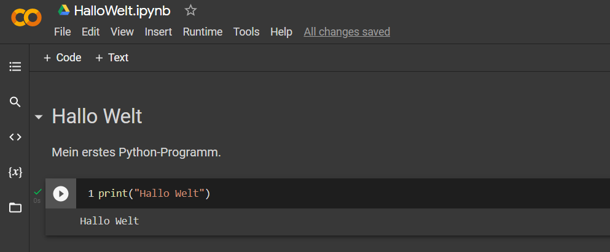

# Python - Quickstart

Es wird sie nicht überraschen, dass Data-Science nur mit Unterstützung eines Computers und speziellen Algorithmen zielführend ist. Hierfür verwenden wir die Programmiersprache Python. Ich empfehle dringend ein der folgenden Varianten zur Nutzung von Python zu verwenden. Wir starten in beiden Varianten mit dem typischerweise ersten Programm für Anfänger, dem Hallo-Welt-Programm. Dieses Programm gibt lediglich den digitalen Gruß "Hallo Welt" in dem vorgesehen Ausgabe Bereich aus. 

## Hallo Welt

Unser kleines Begrüßungsprogramm besteht nur aus einer Zeile


```python
print("Hallo Welt")
```

Die Ausgabe dieses Programms ist:

```
#> Hallo Welt
```

### Variante 1: Colab-Notebooks {-}

Unter dem Link https://colab.research.google.com/ können sie ein sogenanntes Colab-Notebook erstellen. In die Programmzelle können tragen sie die Befehle ein. Ein Klick auf  führt die Programmzeilen aus und schreibt eventuelle Ausgaben unter die Programmzelle.

{width=100%}

Versuchen sie es! Mit `File->Save ` können sie das Notebook abspeichern.  Weitere Hinweise zum Umgang mit Colab-Notebook finden sie unter https://research.google.com/colaboratory/faq.html. Besonders smart ist die Funktion von Textzellen. Sie erlauben das Hinzufügen eigener Texte vor oder nach den Programmzellen; so können sie ein eigenes Skript erstellen.

{width=100%}


### Variante 2: Installation von Python{-}

Alternativ können sie Python auch auf ihrem Rechner installieren. Die Installationsanleitung finden sie auf https://www.python.org/. Um die Installation zu prüfen verwenden sie den Befehl

```bash
python --version	
```

Als Ausgabe erhalten sie die installierte Version von Python, zum Beispiel `Python 3.9.6`. Sie können nun mit einem einfache Texteditor. z.B. Notepad++, die Programmbefehle in eine Datei schreiben. Wenn sie die Zeile `print("Hallo Welt")` in die Datei *HalloWelt.py* schreiben, so können sie das Programm mit folgendem Befehl ausführen.  

```
python HalloWelt.py
```

Sie sollten nun die Ausgabe `Hallo Welt` sehen.

>Verwenden sie die für Python-Programme übliche  Dateiendung  _.py_. Keine Leerzeichen im Dateinamen!  


## Programme und Fehler

Sie werden eventuell Syntax-Fehler in ihren Programmen haben. Syntax-Fehler entstehen, wenn Python ihr Programm nicht versteht. Oft geht es dabei um "Rechtschreibfehler". Schreiben sie also fälschlicherweise `prin("Hallo Welt")`, so erhalten sie bei der Programmausführung ein Fehlermeldung:

```
line 1, in <module>
    prin("Hallo Welt")
NameError: name 'prin' is not defined 
```

Häufig lässt sich diese Meldung leicht verstehen, und sie können den Fehler korrigieren. 

> Läuft ein Programm ohne Fehlermeldung ab, so kann man daraus natürlich nicht auf die Korrektheit des Programms schließen!  Ihr Programm kann also auch noch logisch falsch sein.


## Python lernen

Es geht uns nicht in erster Linie darum gute Python-Programmierer zu werden. Unsere Kenntnisse müssen aber für die Lösung oder Analyse unserer Problemstellungen ausreichen. Das legt auch den Umfang an Python Know-How fest. Es gibt hierfür zahlreiche gute Bücher und Internetquellen. Eine ausgewählter Link, auf den ich regelmäßig verweisen werden ist

https://www.w3schools.com/python/

Suchen sie doch unter *Python Intro* nach dem Hallo-Welt-Beispiel. Sie finden dort unter *Try it Yourself* eine weitere Möglichkeit Python-Programme auszuführen!

