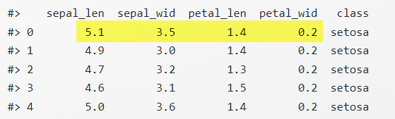

# Feature-Matrix und Label

In diesem kurzen Abschnitt definieren vorbereitend für den Abschnitt zu Machine-Learning wesentliche Begriffe und stellen einen Bezug zu den aus der linearen Algebra bekannten Konzepten von Vektor und Matrix her.

## Numerische Features (Merkmal)

Ein numerisches Feature ist ein **Einzelaspekt **einer Beobachtung oder Messung unserer Objekte, der sich als Zahl ausdrücken lässt. Ein Beispiel aus dem Iris-Datensatz ist  "Länge der Petalums".  Die Anzahl der Features einer Problemstellung nennen notieren wir mit dem Buchstaben $m$. Bei Iris: $m = 4$.

## Feature-Vektor (Merkmals-Vektor)

Feature-Vektor ist eine Gruppierung der konkreten gemessenen Werte der Features als Vektor. Diese Gruppierung notiert man in der Regel als Zeilenvektor $\bf{x} \in \mathbb{R}^{m}$. Ein Beispiel aus dem Iris-Datensatz ist der (erste) Feature-Vektor

$$
\textbf{x}= (5.1, 3.5, 1.4, 0.2 ) \in \mathbb{R}^4
$$

In nachfolgender Abbildung ist dieser Feature-Vektor gelb markiert.

Alternative Namen für einen Feature-Vektor sind

- Merkmals-Vektor
- Example
- Sample

## Feature-Matrix

Eine Feature-Matrix besteht aus n Feature-Vektoren als Zeilen. Wir notieren die Feature-Matrix stets ebenfalls mit dem Symbol $X$. Es ist:

$$
X \in \mathbb{R}^{n \times m}
$$

**Beispiel** **(Iris)**:  Die 150 Feature-Vektoren aus Iris bilde die  Feature-Matrix $X \in \mathbb{R}^{150 \times 4}$. 

## Label 

Zu jedem Feature-Vektor interessiert uns eine "Antwort"  oder ein "Ergebnis". Zum Beispiel fragen wir danach, zu welcher Gattung die Lilie mit dem Feature-Vektor $\textbf{x}= (5.1, 3.5, 1.4, 0.2 )$ gehört. Diese Information nennen wir **Label** zum Feature-Vektor $\bf{x}$. Wir bezeichnen den Label stets mit $\bf{y}$.  Der Label kann ebenfalls ein Vektor oder auch nur ein einzelner Wert sein. Letzteres ist in unseren Beispielen stets der Fall.

## Labelled Example

Das Paar $(\textbf{x},\bf{y})$ bestehend aus dem Feature-Vektor  und dem Label $\bf{y}$. heißt auch **Labelled Example**.

Schreibweise: Notieren wir den Feature-Vektor im Kontext mit  $\bf{x_i}$, so schreiben wir $\bf{y_i}$ für den zugehörigen Label. 

## Bemerkungen	

Wir haben Feature-Vektoren in Analogie zur lineare Algebra definiert. Sie bestehen damit nur aus Zahlen. Alle bekannten Operationen sind definiert und grundsätzlich erlaubt. In der Praxis kann das zu Problemen führen, sofern Messungen nominal Skalen vorliegen, oder Werte fehlen.

  

