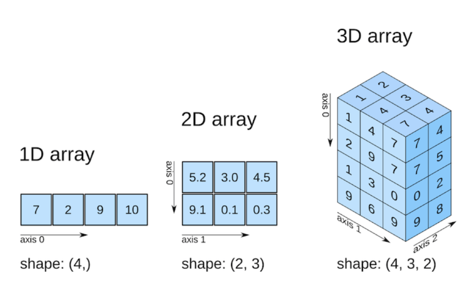

# Numpy-Arrays
## Wofür brauchen wir Numpy?

Numpy ist eine Python-Library^[Eine Python-Library umfasst vorgefertigte Programmen, die von Programmieren genutzt werden, um Programme schneller und sicherer zu erstellen. ] (Bibliothek von Funktionen) für die effiziente Erzeugung, Berechnung und Bearbeitung von Daten, insbesondere numerischen Daten. Wir nutzen Numpy für den Umgang mit Vektoren, Matrizen oder Tensoren.^[Numpy kann auch für nicht-numerische Datentypen genutzt werden, aber das ist für uns nicht von Belang.] 

Wir werden Numpy nutzen, um die Datensätze für maschinelles Lernen zu bearbeiten. Eine umfangreiche und behutsame Einführung finden sie unter [https://www.w3schools.com/python/numpy/](https://www.w3schools.com/python/numpy/). Wir besprechen in diesem Abschnitt nur die für unsere Inhalte relevanten Teile.

::: {.rmdnote}
**Wichtig:** Beginnen Sie jeden Programmblock, in dem sie numpy-Funktionen brauchen, mit der Zeile `import numpy as np`
:::

## Numpy-Arrays


## Vektor mit Numpy

Folgende Code zeigt, wie der erste Datensatz $(5.1, 3.5, 1.4, 0.2) \in \mathbb{R}^4$ aus dem Iris-Dataset als Vektor
$$
\mathbf{x} = (5.1, 3.5, 1.4, 0.2) \in \mathbb{R}^4
$$
in einer Variable mit dem Namen `x` erzeugt wird^[Genaugenommen nur die ersten vier Spalten. Wir lassen die Spalte `class` weg.]. 

### Beispiel
```{python, results="hide"}
import numpy as np
x = np.array( [5.1, 3.5, 1.4, 0.2]) 
print( x )
print( type(x) )
```
Ausgabe: Wir sehen die Darstellung des Vektors, strukturiert über eckige Klammern und den neuen Datentyp `numpy.ndarray`.
```{python, echo=FALSE}
import numpy as np
x = np.array( [5.1, 3.5, 1.4, 0.2]) 
print( x)
print( type(x))
```
Wir werden sehen, dass wir den aus der Mathematik gewohnten Umgang  mit Vektoren (und Matrizen) einfach in  Numpy übertragen können.


### Shape (Dimension)

Das Attribut `shape` liefert die Dimension eines Arrays.

```{python, results="hide"}
import numpy as np
x0 = np.array( [5.1, 3.5, 1.4, 0.2]) 
print( x0.shape )
```
Die Ausgabe `(4,)` bedeutet, dass die Struktur aus 4 Zahlen entlang einer Dimension besteht. (Das wird im nachfolgenden Abschnitt spannender.)
```{python, echo=FALSE}
import numpy as np
f0 = np.array( [5.1, 3.5, 1.4, 0.2]) 
print( f0.shape )
```
### Zugriff auf Elemente
Für einen Vektor $\bf{x} \in \mathbb{R}^n$ nehmen wir auf die einzelnen Werte  mittels $x = (x_1, ..., x_n)$ durch Verwendung eines tiefgestellten Index  Bezug. Für  $\mathbf{x} = (5.1, 3.5, 1.4, 0.2) \in \mathbb{R}^4$ ist also $x_1 = 5.1$. In Numpy machen wir das analog, **starten die Nummerierung jedoch bei Null**, wie folgendes Beispiel zeigt. Beachten sie die Analogie zu Listen in Abschnitt \label{listen} .

```{python, results="hide"}
import numpy as np
x = np.array( [5.1, 3.5, 1.4, 0.2]) 
print( x[0] )
```
Ausgabe:
```{python, echo=FALSE}
import numpy as np
x = np.array( [5.1, 3.5, 1.4, 0.2]) 
print( x[0] )
```


 **Übung: **Geben sie das letzte Element mit dem Wert 0.2 aus. 


### Werte verändern

Mit der Verwendung des Index können wir einzelne Einträge auch verändern. Wir sehen behandeln dazu den Ausdruck x[0] einfach als Variable und verwenden eine Wertzuweisung.

```{python, results="hide"}
import numpy as np
x = np.array( [5.1, 3.5, 1.4, 0.2]) 
x[0] = -3
print(x)
```
Ausgabe:
```{python, echo=FALSE}
import numpy as np
x = np.array( [5.1, 3.5, 1.4, 0.2]) 
x[0] = -3
print(x)
```
### Skalare Multiplikation und Addition

```{python, results="hide"}
import numpy as np
x = np.array([1, 4, 9, 0])
y = np.array([1, 0, 1, 0])
print(x*0.5)
print(x+y)
print(x-y)
```
Ausgabe:
```{python, echo=FALSE}
import numpy as np
x = np.array([1, 4, 9, 0])
y = np.array([1, 0, 1, 0])
print(x*0.5)
print(x+y)
print(x-y)
```
### Neue Rechenarten
```{python, results="hide"}
import numpy as np
x = np.array([1, 4, 9, 0])
y = np.array([1, 0, 1, 0])

print(x+1)
print(x*y)
```
Ausgabe:
```{python, echo=FALSE}
import numpy as np
x = np.array([1, 4, 9, 0])
y = np.array([1, 0, 1, 0])

print(x+1)
print(x*y)
```


## Matrix mit Numpy

Matrizen werden in Numpy als eine Ansammlung von Zeilenvektoren aufgebaut!

### Beispiel

```{python, results="hide"}
import numpy as np

A = np.array([[1,2],[3,4], [5,6], [7,8]])
print( A )
print( A[0,0] )
print( A[0,1] )
```
Ausgabe: 
```{python, echo=FALSE}
import numpy as np
A = np.array([[1,2],[3,4], [5,6], [7,8]])
print( A )
print( A[0,0] )
print( A[0,1] )
```
Die Indizierung der Element funktioniert erwartungsgemäß, allerdings wird mit der Zählung bei Null begonnen!


### Shape (Dimension)

Eine Matrix hat eine Anzahl von Zeilen und Spalten. Wir verwenden wie bei Vektoren `shape`, um die Dimension zu erfahren 

```python
import numpy as np

A = np.array([[1,2],[3,4], [5,6], [7,8]])
print( A.shape )
```


Ausgabe:
```{python, echo=FALSE}
import numpy as np

A = np.array([[1,2],[3,4], [5,6], [7,8]])
print( A.shape )  # Ausgabe: (4,2)
```

Die Ausgabe (4,2) besagt, dass die Matrix vier Zeilen und zwei Spalten besitzt. Allgemein gesagt, dass 4 Werte entlang der ersten Dimension und 2 Werte entlang der zweiten Dimension angeordnet werden.


### Skalare Multiplikation und Addition

```{python, results="hide"}
import numpy as np

A = np.array([[1,2],[3,4], [5,6], [7,8]])
B = np.array([[10,20],[30,40], [50,60], [70,80]])
s = 2;
print (2*A)     # Mulitplikation mit einem Skalar
print (A+B)
```
Ausgabe:
```{python, echo=FALSE}
import numpy as np

A = np.array([[1,2],[3,4], [5,6], [7,8]])
B = np.array([[10,20],[30,40], [50,60], [70,80]])
s = 2;
print (2*A)     # Mulitplikation mit einem Skalar
print (A+B)
```


### Matrixmultiplikation

Die Matrixmultiplikation erfolgt über den Befehl `np.dot`. Wir berechnen als Beispiel folgendes Produkt (Immer auf die passenden shapes achten!):

$$
\mathbf{A}= \begin{bmatrix} 1 & 2 \\ 3 & 4 \\ 5 & 6 \end{bmatrix} \quad\quad\quad
\mathbf{B}= \begin{bmatrix} 1 & 0 \\ 0 & 2 \end{bmatrix}  \quad\quad\quad
\mathbf{A} \mathbf{B}= \begin{bmatrix} 1 & 4 \\ 3 & 8 \\ 5 & 12 \end{bmatrix} \quad\quad\quad
$$
Mit Numpy: `np.dot()`

```{python, results="hide"}
import numpy as np

A = np.array([[1,2],[3,4], [5,6] ])
B = np.array([[1,0],[0,2]])
AB = np.dot(A, B) 
print( AB )
```
Ausgabe:
```{python, echo=FALSE}
import numpy as np

A = np.array([[1,2],[3,4], [5,6] ])
B = np.array([[1,0],[0,2]])
AB = np.dot(A, B) 
print( AB )
```

### Übungen

Lösen sie die Aufgaben aus Abschnitt \@ref(matrix-uebung) mit geeigneten Python-Programmen.


## Allgemeine Numpy-Arrays

Vektoren und Matrizen über reellen Zahlen lassen sich mit Numpy bequem darstellen. 

#### 1D-Array {-}

Ein Vektor ist eine Struktur mit einer Achse. (Wir vermeiden den Begriff Dimension, weil er für Vektoren bereits belegt ist.) Entsprechend brauchen wir für einen Vektor *einen* Index um einen Wert zu erreichen. Diese Struktur wird in Numpy 1D-Array genannt. Der Shape ist ein Tupel der Länge 1. Der Eintrag sagt uns, wie viele Werte in Achse 0 enthalten sind.

#### 2D-Array {-}

Eine Matrix ist eine Struktur mit zwei Achsen. Entsprechend brauchen wir für eine Matrix *zwei*  Indizes, um einen Wert zu erreichen und für eine Matrix *zwei* Indizes um einen Wert zu erreichen.  Der Shape ist nun ein Tupel der Länge 2. Die Einträge sagen uns, wie viele Werte in Achse 0 und in Achse 1 enthalten sind.

#### 3D-Array {-}

Eine Matrix ist eine Struktur mit drei Achsen. Entsprechend brauchen wir für ein 3D-Array *drei*  Indizes, um einen Wert zu erreichen.  Der Shape ist hier ein Tupel der Länge 3. Die Einträge sagen uns, wie viele Werte in den Achsen 0, 1 und 2 enthalten sind. 

Für uns sind 3D-Arrays relevant, zum Beispiel bei der Verarbeitung von Bildern. Wir werden darauf später noch zurückkommen. 


{width=70%}

Arrays mit mehr Achsen funktionieren analog. Beachten sie, dass die Regeln für skalare Multiplikation gelten, sofern die Shapes indentisch sind!

#### Beispiel {-}

Was gibt folgendes Programm aus?

```{python, results="hide"}
import numpy as np
arr = np.array([
         [ [1, 2, 3], [4, 5, 6] ], 
         [ [7, 8, 9], [10, 11, 12]]
         ])
print(arr[0, 1, 2])
```
Etwas einfacher sollte es sein, wenn sie die Erzeugung von arr etwas anders schreiben:

```
arr = np.array([
         [ [1, 2, 3], [4, 5, 6] ], 
         [ [7, 8, 9], [10, 11, 12]]
         ])
```


## Arrays erzeugen 

Bisher mussten wir Array-Werte eintippen. In diesem Abschnitt lernen wir Funktionen kennen, um Arrays mit beliebigem Shape zu erzeugen

### `np.ones() und np.zeros()`

```{python, results="hide"}
import numpy as np
v = np.ones( (2,3) )
print( v )
```
Ausgabe:
```{python, echo=FALSE}
import numpy as np
v = np.ones( (2,3) )
print( v )
```

### `np.arange`()

Mit `np.arange` erzeugen wir automatisch Vektoren, die wir häufiger brauchen. Beschäftigen Sie sich mit der Ausgabe und experimentieren sie etwas, dann wird die jeweilige Funktion recht schnell klar.

```{python, results="hide"}
import numpy as np
x = np.arange(1,2,0.1)
print( x )
print( x[2] )
print( len(x) )
print ( type(x) )
```
Ausgabe:
```{python, echo=FALSE}
import numpy as np
x = np.arange(1,2,0.1)
print( x )
print( x[2] )
print( len(x) )
print ( type(x) )
```


###  `np.linspace`()
Auch hier ist die Funktionsweise recht offensichtlich.. Sie ist allerdings mit etwas Vorsicht zu genießen...

```{python, results="hide"}
import numpy as np
x = np.linspace(0,1,4);
print(x)
print( x.shape )
```
Ausgabe:
```{python, echo=FALSE}
import numpy as np

x = np.linspace(0,1,4);
print(x)
print( x.shape )
```


## Operationen auf Arrays

### Aggregierende Operationen
```{python, results="hide"}
import numpy as np
x=np.array([1,2,3,4])
print( x.min() )
print( x.max() )
print( x.mean() )
print( x.sum() )
```
Ausgabe:
```{python, echo=FALSE}
import numpy as np
x=np.array([1,2,3,4])
print( x.min() )
print( x.max() )
print( x.mean() )
print( x.sum() )
```

### Elementweise Operationen

 Nachfolgendes Beispiel zeigt ausgewählte Operationen. Beachten Sie diese Operationen so im Mathe-Unterricht nicht gelernt haben. Sie sind jedoch recht hilfreich!

```{python, results="hide"}
import numpy as np
x = np.array([1, 4, 9, 0])
y = np.array([1, 0, 1, 0])

print (x+1)
print(x*y)
print (np.sqrt(x))
print (np.sin(x))
```
Ausgabe:
```{python, echo=FALSE}
import numpy as np
x = np.array([1, 4, 9, 0])
y = np.array([1, 0, 1, 0])

print (x+1)
print(x*y)
print (np.sqrt(x))
print (np.sin(x))
```


## Zufallszahlen

### Gleichverteilung
Nachfolgende Beispiele erzeugen Gleichverteilte Zufallszahlen zwischen 3 und 4.

```{python, results="hide"}
import numpy as np
x = np.random.uniform(3,4)
print(x)

x = np.random.uniform(3,4, size=(5))
print(x)

x = np.random.uniform(3,4, size=(5,2))
print(x)
```
Ausgabe:
```{python, echo=FALSE}
import numpy as np
x = np.random.uniform(3,4)
print(x)

x = np.random.uniform(3,4, size=(5))
print(x)

x = np.random.uniform(3,4, size=(5,2))
print(x)
```

### Normalverteilung

Die Kenntnis der Standardnormalverteilung wird vorausgesetzt. 

```{python, results="hide"}
import numpy as np
x = np.random.normal()
print(x)

mu = 5
sigma = 1
x = np.random.uniform(mu, sigma, size=(5))
print(x)

x = np.random.uniform(mu, sigma, size=(5,2))
print(x)
```
Ausgabe:
```{python, echo=FALSE}
import numpy as np
x = np.random.normal()
print(x)

mu = 5
sigma = 1
x = np.random.uniform(mu, sigma, size=(5))
print(x)

x = np.random.uniform(mu, sigma, size=(5,2))
print(x)
```


### Konstanten

Wir brauchen hier nur für ein paar Übungen die Zahl $\pi$

```{python, results="hide"}
import numpy as np
pi_wert = np.pi
print( pi_wert )
```
Ausgabe:
```{python, echo=FALSE}
import numpy as np
pi_wert = np.pi
print( pi_wert )
```


## Einfache Funktionen

```{python, results="hide"}
import numpy as np

# Sinus
x = np.sin(0)
print( x )

# Quadrieren
x = np.square(3)
print( x )

# PI
x = np.pi
print( x )

# Eulersche Zahl
x = np.e
print( x )
```
Ausgabe:
```{python, echo=FALSE}
import numpy as np

# Sinus
x = np.sin(0)
print( x )

# Quadrieren
x = np.square(3)
print( x )

# PI
x = np.pi
print( x )

# Eulersche Zahl
x = np.e
print( x )
```


-->

