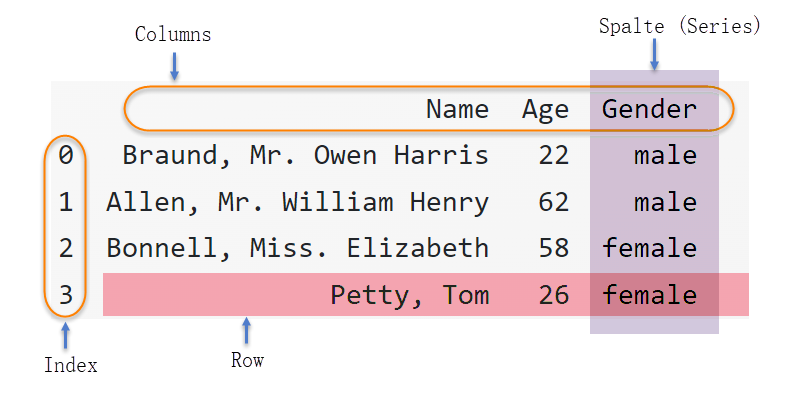

# Dataframes

Ein Dataframe ist eine Tabellenstruktur von Daten (ähnlich zu Excel) mit  Spaltenüberschriften und Zeilenbezeichnungen (in der Regel Zeilennummern). Viele Datensätze im Machine Learning liegen als Datentabellen vor und können daher mit Dataframes gut verarbeitet werden.

Wir können damit einzelne Werten, Spalten oder Zeilen direkt über den Namen ansprechen und die über Numpy hinaus gehenden Analysefunktionen benutzen. Numerische Spalten oder Zeilen lassen sich in Numpy-Arrays konvertieren, so dass wir alle Numpy-Funktionen zur Verfügung haben.

## Grundlagen

Folgende Abbildung zeigt den Aufbau eines Dataframes.

{width=80%}


### Beispiel

```{python, results="hide"}
import pandas as pd
df = pd.DataFrame({
   "Name": ["Braund, Mr. Owen Harris",
            "Allen, Mr. William Henry",
          "Bonnell, Miss. Elizabeth",
          "Petty, Tom"],
    "Age": [22, 62, 58, 26],
   "Gender": ["male", "male", "female", "female"]}
  )

# Dataframe-Informationen ausgeben
print( "\n -------- Data")
print( df )
print( "\n -------- Head")
print( df.head(2) )
print( "\n -------- Tail")
print( df.tail(1) )
print( "Anzahl der Zeilen : ", len(df))
print( "Shape             : ", df.shape)
print( "Columns :" )
print( df.columns )
print( "Index :" )
print( df.index )
```
Ausgabe:
```{python, echo=FALSE}
import pandas as pd
df = pd.DataFrame({
   "Name": ["Braund, Mr. Owen Harris",
            "Allen, Mr. William Henry",
          "Bonnell, Miss. Elizabeth",
          "Petty, Tom"],
    "Age": [22, 62, 58, 26],
   "Gender": ["male", "male", "female", "female"]}
  )

# Dataframe-Informationen ausgeben
print( "\n -------- Data")
print( df )
print( "\n -------- Head")
print( df.head(2) )
print( "\n -------- Tail")
print( df.tail(1) )
print( "Anzahl der Zeilen : ", len(df))
print( "Shape             : ", df.shape)
print( "Columns :" )
print( df.columns )
print( "Index :" )
print( df.index )
```

### Überblick verschaffen

Um sich einen weiteren  Überlick über die Daten zu verschaffen sind folgende Funktionen hilfreich

- `.info()`
- `.describe()`

```{python, results="hide"}
import pandas as pd
df = pd.DataFrame({
   "Name"  : ["Braund, Mr. Owen Harris",
             "Allen, Mr. William Henry",
             "Bonnell, Miss. Elizabeth",
             "Petty, Tom"],
    "Age"  : [22, 62, 58, 26],
   "Gender": ["male", "male", "female", "female"]}
)
df.info()
```
Ausgabe:
```{python, echo=FALSE}
import pandas as pd
df = pd.DataFrame({
   "Name"  : ["Braund, Mr. Owen Harris",
             "Allen, Mr. William Henry",
             "Bonnell, Miss. Elizabeth",
             "Petty, Tom"],
    "Age"  : [22, 62, 58, 26],
   "Gender": ["male", "male", "female", "female"]}
)
df.info()
```

Mit `df.describe()` erhalten wir eine einfache statistische Auswertung aller Spalten **mit numerischem Datentyp**. 

```{python, results="hide"}
import pandas as pd
df = pd.DataFrame({
   "Name"  : ["Braund, Mr. Owen Harris",
             "Allen, Mr. William Henry",
             "Bonnell, Miss. Elizabeth",
             "Petty, Tom"],
    "Age"  : [22, 62, 58, 26],
   "Gender": ["male", "male", "female", "female"]}
)
df.describe()
```
Ausgabe:
```{python, echo=FALSE}
import pandas as pd
df = pd.DataFrame({
   "Name"  : ["Braund, Mr. Owen Harris",
             "Allen, Mr. William Henry",
             "Bonnell, Miss. Elizabeth",
             "Petty, Tom"],
    "Age"  : [22, 62, 58, 26],
   "Gender": ["male", "male", "female", "female"]}
)
df.describe()
```


### Eine Spalte auswählen (*Series*)
Eine einzelne Spalte eines Dataframes ist häufig Gegenstand umfangreicher Untersuchungen, um etwas über die Struktur der Daten zu erfahren. Der technische Name für eine Spalte ist *Series*. 

```{python, results="hide"}
import pandas as pd
df = pd.DataFrame({
   "Name"  : ["Braund, Mr. Owen Harris",
             "Allen, Mr. William Henry",
             "Bonnell, Miss. Elizabeth",
             "Petty, Tom"],
    "Age"  : [22, 62, 58, 26],
   "Gender": ["male", "male", "female", "female"]}
)

spalte = df["Age"] # <--
print ( spalte)
print( type( spalte ) )
```
Ausgabe:
```{python, echo=FALSE}
import pandas as pd
df = pd.DataFrame({
   "Name"  : ["Braund, Mr. Owen Harris",
             "Allen, Mr. William Henry",
             "Bonnell, Miss. Elizabeth",
             "Petty, Tom"],
    "Age"  : [22, 62, 58, 26],
   "Gender": ["male", "male", "female", "female"]}
)

spalte = df["Age"] # <--
print ( spalte)
print( type( spalte ) )
```

### Mehrere Spalten auswählen

Wir können aus einem Dataframe Spalten streichen. Hierzu wählen wir nur diejenigen Spalten aus, die im Dataframe verbleiben sollen.

```{python, results="hide"}
import pandas as pd
df = pd.DataFrame({
   "Name"  : ["Braund, Mr. Owen Harris",
             "Allen, Mr. William Henry",
             "Bonnell, Miss. Elizabeth",
             "Petty, Tom"],
    "Age"  : [22, 62, 58, 26],
   "Gender": ["male", "male", "female", "female"]}
)

df_teil = df[["Age", "Gender"]]  # <--
print ( df_teil )
print( type( df_teil ) )
```
Ausgabe:
```{python, echo=FALSE}
import pandas as pd
df = pd.DataFrame({
   "Name": ["Braund, Mr. Owen Harris",
            "Allen, Mr. William Henry",
          "Bonnell, Miss. Elizabeth",
          "Petty, Tom"],
    "Age": [22, 62, 58, 26],
   "Gender": ["male", "male", "female", "female"]}
  )

df_teil = df[["Age", "Gender"]]
print ( df_teil )
print( type( df_teil ) )
```

### Verschiedene Werte pro Spalte

```{python, results="hide"}
import pandas as pd
df = pd.DataFrame({
   "Name"  : ["Braund, Mr. Owen Harris",
             "Allen, Mr. William Henry",
             "Bonnell, Miss. Elizabeth",
             "Petty, Tom"],
    "Age"  : [22, 62, 58, 26],
   "Gender": ["male", "male", "female", "female"]}
)
df.nunique() # <--
```
Ausgabe:
```{python, echo=FALSE}
import pandas as pd
df = pd.DataFrame({
   "Name": ["Braund, Mr. Owen Harris",
            "Allen, Mr. William Henry",
          "Bonnell, Miss. Elizabeth",
          "Petty, Tom"],
        "Age"  : [22, 62, 58, 26],
   "Gender": ["male", "male", "female", "female"]}
  )
df.nunique()
```

### Numpy-Array aus Dataframe erzeugen

```{python, results="hide"}
import pandas as pd
df = pd.DataFrame({
   "Name"  : ["Braund, Mr. Owen Harris",
             "Allen, Mr. William Henry",
             "Bonnell, Miss. Elizabeth",
             "Petty, Tom"],
    "Age"  : [22, 62, 58, 26],
   "Gender": ["male", "male", "female", "female"]}
)

arr = df.to_numpy()
print( arr )
print("Type  : ", type(arr))
print("Shape : ", arr.shape)
```
Ausgabe:
```{python, echo=FALSE}
import pandas as pd
df = pd.DataFrame({
   "Name": ["Braund, Mr. Owen Harris",
            "Allen, Mr. William Henry",
          "Bonnell, Miss. Elizabeth",
          "Petty, Tom"],
    "Age": [22, 62, 58, 26],
   "Gender": ["male", "male", "female", "female"]}
)

arr = df.to_numpy()
print( arr )
print("Type  : ", type(arr))
print("Shape : ", arr.shape)
```

Diese funktioniert auch mit einer "Series". Versuchen sie das als Übung!

### Dataframe aus Numpy-Array erzeugen

```{python, results="hide"}
import numpy as np
import pandas as pd
A = np.array([[1, 2], [3.1, -4.2]])
df2 = pd.DataFrame(data=A, index=["Zeile 1", "Zeile 2"], columns=["Spalte 1","Spalte 2"])
print( df2 )
```
Ausgabe:
```{python, echo=FALSE}
import numpy as np
import pandas as pd
A = np.array([[1, 2], [3.1, -4.2]])
df2 = pd.DataFrame(data=A, index=["Zeile 1", "Zeile 2"], columns=["Spalte 1","Spalte 2"])
print( df2 )
```
### Spaltennamen ändern
Wir werden an wenigen Stelen die Spaltennamen eines Dataframes ändern müssen. Dies ist zwar ein Detailopertation, aber der Vollständigkeit halber führen wir sie hier auf. Entscheinden ist die mit <-- markierte Zeile.

```{python, results="hide"}
import pandas as pd
df = pd.DataFrame({
   "Name": ["Braund, Mr. Owen Harris",
            "Allen, Mr. William Henry",
          "Bonnell, Miss. Elizabeth",
          "Petty, Tom"],
    "Age": [22, 62, 58, 26],
   "Gender": ["male", "male", "female", "female"]}
  )

print( df.head(3) )

df.columns=["Nachname", "Alter", "Geschlecht"] # <-- Änderung
print(" \nNach Änderung : ")
print( df.head(3) )
```
Ausgabe:
```{python, echo=FALSE}
import pandas as pd
df = pd.DataFrame({
   "Name": ["Braund, Mr. Owen Harris",
            "Allen, Mr. William Henry",
          "Bonnell, Miss. Elizabeth",
          "Petty, Tom"],
    "Age": [22, 62, 58, 26],
   "Gender": ["male", "male", "female", "female"]}
  )

print( df.head(3) )

df.columns=["Nachname", "Alter", "Geschlecht"]
print(" \nNach Änderung : ")
print( df.head(3) )
```

