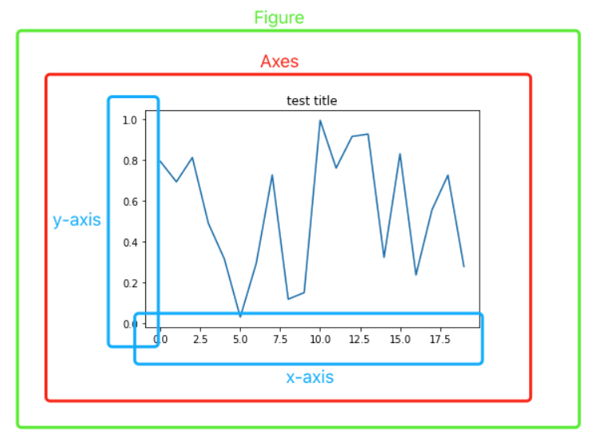

# (PART) Teil B: Visualisierung {-} 
# Visualisierung mit matplotlib

Mathplotlib ([https://matplotlib.org/](https://matplotlib.org)) ist eine Sammlung von Funktionen (Bibliothek) zum Visualisieren von Daten.  Es gibt eine Fülle von Visualisierungsvarianten, unter denen wir einige wesentliche auswählen.

## Balken, Punkte und Linien

Wichtig: Sie müssen die folgenden beiden Zeilen stets am Beginn des Programms stehen haben.



### Liniendiagramm

```{python}
import matplotlib.pyplot as plt
import numpy as np

# Daten erzeugen
x = [0,1,2,3,4,5,6,7,8,9,10]
y = [0,1,0,1,0,1,0,1,0,1,0]

# Style auswählen
plt.style.use('seaborn')

# Leeren Graph erzeugen
# figsize: Figure dimension (width, height) in inches.
fig, ax = plt.subplots(figsize=(7, 3))

#Achsen definieren
ax.set_title("Title") 
ax.set_xlabel("x-axis")
ax.set_ylabel("y-axis")
ax.set_aspect('equal')

ax.set(xlim=(0, 10), xticks=np.arange(0, 11),
       ylim=(-1, 2), yticks=np.arange(0, 2))

#Plotten
z = ax.plot(x, y, linewidth=2.0)

#Anzeigen
plt.show()
```

Wichtig:

- Wenn sie `xticks` und `yticks` weglassen, entscheidet `plt` selbst über die Ticks.
- Mit `ax.set_aspect('equal')` sorgen Sie für eine identische Skalierung beider Achsen.
- Mit `figsize=(9, 12)` legen sie die Größe der Grafik fest (Breite und Höhe in Inch).
- Mit `plt.style.use('seaborn')` wird ein Diagramm-Stil^[Mögliche Werte sind: `_classic_test_patch, bmh, classic, dark_background, fast, fivethirtyeight, ggplot, grayscale, seaborn, seaborn-bright, seaborn-colorblind, seaborn-dark, seaborn-dark-palette, seaborn-darkgrid, seaborn-deep, seaborn-muted, seaborn-notebook, seaborn-paper, seaborn-pastel, seaborn-poster, seaborn-talk, seaborn-ticks, seaborn-white, seaborn-whitegrid, tableau-colorblind10`] ausgewählt. Sie finden Styles hier: https://matplotlib.org/3.5.1/gallery/style_sheets/style_sheets_reference.html.

### Plots (Graphen)

```{python, results="hide"}
import matplotlib.pyplot as plt
import numpy as np

plt.style.use('seaborn')
x = np.linspace(0, 8, 100)
y = 3 + 2 * np.sin(np.pi * 0.5 * x )

fig, ax = plt.subplots( figsize=(7,4))
ax.plot(x, y, linewidth=2.0)

ax.set_aspect('equal')
ax.set(xlim=(0, 8), 
       ylim=(0, 5.1))

plt.show()
```

### Scatterplot

```{python, results="hide"}
import matplotlib.pyplot as plt
import numpy as np
np.random.seed(19680801)
N = 50
x = np.random.rand(N)
y = np.random.rand(N)
fig, ax = plt.subplots(figsize=(7, 3))
ax.scatter(x, y )
plt.show()
```

### Scatterplot (Farbe und Bubbles)

```{python, results="hide"}
import matplotlib.pyplot as plt
import numpy as np
N = 50
x = np.random.rand(N)
y = np.random.rand(N)
colors = np.random.rand(N)
area = (30 * np.random.rand(N))**2  # 0 to 15 point radii
plt.scatter(x, y, s=area, c=colors, alpha=0.5)
plt.show()
```

## Bilder

Bilder lassen sich als Numpy-Arrays darstellen und bearbeiten. Unterstützte shapes sind:

* (M, N): ein Bild mit skalaren Werten (0-1 float oder 0-255 int). 
* (M, N, 3): ein Farbbild mit RGB-Werten (0-1 float oder 0-255 int).

Die ersten beiden Werte (M, N) definieren die Anzahl der Zeilen und Spalten des Bildes. Farbgebung erfolgt über eine _colormap_.

(Taken from [https://matplotlib.org/3.1.1/api/\_as\_gen/matplotlib.pyplot.imshow.html](https://matplotlib.org/3.1.1/api/\_as\_gen/matplotlib.pyplot.imshow.html))


### Beispiel 1: Unicolor

Folgende Befehle erzeugen ein künstliches und (gleichverteilt) zufälliges Grauwertbild:

```{python, results="hide"}
import matplotlib.pyplot as plt
import numpy as np
plt.style.use('default')
plt.subplots(figsize=(9, 3))

img = np.random.uniform(0,1, size=(10,10))
plt.imshow(img, cmap= plt.cm.get_cmap('Oranges'), vmin=0, vmax=1  )
```
Der spannende Statement <todo: explain> ist nun `plt.imshow()`. Die Parameter haben folgende Bedeutung:

- **img** ist das Numpy-Array mit dem Bild
- **cmap** legt fest, wie die Werte des Arrays in Farben umgewandelt werden.  Diese sog. Colormaps finden sie unter [https://matplotlib.org/3.1.0/tutorials/colors/colormaps.html](https://matplotlib.org/3.1.0/tutorials/colors/colormaps.html). Sie können auch probieren: `'Greys', 'Purples', 'Blues', 'Greens', 'Oranges', 'Reds', 'YlOrBr', 'YlOrRd', 'OrRd', 'PuRd', 'RdPu', 'BuPu', 'GnBu', 'PuBu', 'YlGnBu', 'PuBuGn', 'BuGn', 'YlGn'`
- **vmin** und **vmax** legen fest, welcher Wertebereich variabel in Farben übertragen wird. Werte unter `vmin` werden auf den dunkelsten Wert der Colormap gesetzt, Werte über `vmax` auf den hellsten Wert der Colormap gesetzt.


### Beispiel 2: Farbbild

```{python, results="hide"}
import numpy as np
import matplotlib.pyplot as plt
img = np.zeros( (200,200,3))
img[:,:,1] = np.ones((200))
plt.figure()
plt.imshow( img  )
```

### Komplett zufälliges Farbbild

```{python, results="hide"}
import numpy as np
import matplotlib.pyplot as plt
img = np.random.random( 200*200*3).reshape(200,200,3)
plt.figure(figsize= (7,7))
plt.imshow( img  )
```

### Farbbilder aus Datei laden

```{python}
import numpy as np
import matplotlib.pyplot as plt

url = 'http://www.dietergreipl.de/wp-content/uploads/2019/10/owl-50267_1920.png'
eule = plt.imread( url )
print(eule.shape)
print(np.max( eule ))
print(np.min( eule ))

plt.figure( figsize=(8,5)) #Use in (15,9) in test
plt.imshow( eule )

```

Informationen zum Bild erhalten wir mit den Ausgaben der letzen drei Programmzeilen:

Ausgabe:
```{python, echo=FALSE}
print(eule.shape)
print(np.max( eule ))
print(np.min( eule ))
```
### Übungen 

#### Colormaps

Was versteht man unter folgenden Typen von Colormaps:

- sequentiell
- divergent
- zyklisch
- qualitativ

Hinweis: https://matplotlib.org/3.5.0/tutorials/colors/colormaps.html 


#### Wie kommt dieses Bild zustande?

Erläutern Sie, wie das Bild erstellt wird, speziell die for-Schleife: <todo: Schleife einführen, und slicing von Arrays einführen>

```{python, results="hide"}
import numpy as np
import matplotlib.pyplot as plt

img= np.ones((200, 200))

for col in range(0, 200):
  img[:,col] = col

plt.figure(figsize= (6,6))
plt.imshow( img, cmap= plt.get_cmap('gray'), vmin=0, vmax=200)
```


#### Erklären sie die Ausgabe dieses Programms:

```{python, results="hide"}
import numpy as np
import matplotlib.pyplot as plt
img = np.random.normal(0.5, 0.1, size = (200,200,3))
plt.figure(figsize= (6,6))
plt.imshow( img  )
```

###  

## Statistik

### Boxplots


## Steinbruch

## ##Liniendiagramme

Hier ein erstes Beispiel:

```python
#Line
sns.scatterplot(x=years, y=gdp, color="red", label="My Label")
```


## Barplot

```
sns.barplot(x=years, y=gdp, color="red", label="My Label")
```


## Histogramme

```python
import matplotlib.pyplot as plt
import seaborn as sns

x_werte =  [1, 2, 2, 3,3, 4, 5, 6, 7, 8, 9, 10]

sns.set()
sns.histplot(x = x_werte,
             #binwidth=1,
             #bins="auto",
             bins=[0,2,5,7,10],
             kde = False)
```


## Boxplots

Link: [https://seaborn.pydata.org/generated/seaborn.boxplot.html](https://seaborn.pydata.org/generated/seaborn.boxplot.html)&#x20;

Link: https://towardsdatascience.com/understanding-boxplots-5e2df7bcbd51 


Vertiefung:

[Outliers, Inliers, and Other Surprises that Fly from your Data | Rocket-Powered Data Science (rocketdatascience.org)](http://rocketdatascience.org/?p=473)


```python
import matplotlib.pyplot as plt
import seaborn as sns

x = np.arange(1,101)
x = np.concatenate( (x, [152] ))

percentiles = np.percentile( x, [0,25,50,75,100])
IQR = (percentiles[3] -  percentiles[1])
print( "Pericentile         : ", percentiles)
print( "IQR                 : ", IQR)
print( "Upper Outlier Limit : ", percentiles[3] + 1.5*IQR)
sns.boxplot(x = x)
```


## Übungen


## Visualisierungsübung 1

Versuchen sie folgende Kurve zu zeichnen:


(Die Lösung finden sie am Ende des Dokumentes)

## Visualisierungsübung 2


1. Sie können mit numpy  eine Liste mit 50 gleichverteilen Zufallszahlen erstellen. Erzeugen Sie zwei dieser Listen (x und y) und zeigen sie die 50 Paare Paare (x\[i], y\[i]) in einem Scatterplot an.  So ähnlich (!) sollte die Ausgabe aussehen:

   

 

   

2. Welches Ausgabe erwarten Sie, wenn Sie in 1. statt 50 Zahlen jeweils 2000 Zahlen erzeugen? Beschreiben sie das Ergebnis in 2-3 Sätzen. 
   
3. Wiederholen sie Aufgabe 1 mit der Normalverteilung (Erwartungswert 0, Standardabweichung 1) statt der Gleichverteilung. Verwenden sie 2000 Punkte. Überlegen sie  bitte vorher: welche grafischen Ausgabe erwarten sie?
   
4. Erzeugen Sie ein Histogramm für die Erzeugung von 10000 gleichverteilten (normalverteilten) Zufallszahlen. So ähnlich sollte das Ergebnis aussehen:


## Plots für Iris

## Laden der Daten

```
import pandas as pd
from sklearn import datasets

import matplotlib.pyplot as plt
import seaborn as sns

iris = datasets.load_iris()
iris_df = pd.DataFrame(iris.data)
iris_df['class']=iris.target_names[iris.target ]
iris_df.columns=['sepal_len', 'sepal_wid', 'petal_len', 'petal_wid', 'class']
```


## Histogramm für ein Feature

```python
sns.set()
sns.histplot( iris_df, 
             x ="petal_wid", 
             bins=10,  # try bins="auto" und bins=10
             kde = False)
```


## Relation-Plots 

```
sns.relplot(data=iris_df, x="petal_len", y="sepal_wid", hue = "class", height=7)
```


## Pairplots

```
sns.pairplot(iris_df[['sepal_len', 'sepal_wid', 'petal_len', 'petal_wid', 'class']],
             hue="class", diag_kind="kde")
```


## Beispiele: Bilder

Bilder lassen sich als Numpy-Arrays darstellen und bearbeiten. Unterstützte shapes sind:

* (M, N): ein Bild mit skalaren Werten (0-1 float oder 0-255 int). Visualisierung erfolgt über eine _colormap_.
* (M, N, 3): ein Farbbild mit RGB Werten (0-1 float oder 0-255 int).

Die ersten beiden Werte (M, N) definieren die Anzahl der Zeilen und Spalten des Bildes.

(Taken from [https://matplotlib.org/3.1.1/api/\_as\_gen/matplotlib.pyplot.imshow.html](https://matplotlib.org/3.1.1/api/\_as\_gen/matplotlib.pyplot.imshow.html))


## Grauwert-Bilder als nxm Matrix

Folgende Befehle erzeugen ein künstliches und (gleichverteilt) zufälliges Grauwertbild:

```python
import matplotlib.pyplot as plt
import numpy as np

img = np.random.rand(10,10)
plt.imshow(img, cmap= plt.cm.get_cmap('Oranges'), vmin=0, vmax=1  )
```

Colormaps finden sie unter [https://matplotlib.org/3.1.0/tutorials/colors/colormaps.html](https://matplotlib.org/3.1.0/tutorials/colors/colormaps.html). Sie können auch probieren: 'Greys', 'Purples', 'Blues', 'Greens', 'Oranges', 'Reds', 'YlOrBr', 'YlOrRd', 'OrRd', 'PuRd', 'RdPu', 'BuPu', 'GnBu', 'PuBu', 'YlGnBu', 'PuBuGn', 'BuGn', 'YlGn'


## Farbbilder aus Datei laden

```python
import numpy as np
import matplotlib.pyplot as plt

url = 'http://www.dietergreipl.de/wp-content/uploads/2019/10/owl-50267_1920.png'
eule = plt.imread( url )
print(eule.shape)
print(np.amax( eule ))
print(np.amin( eule ))
plt.figure( figsize=(20,15))
plt.imshow( eule )
```


## Einfache Farbbilder erzeugen

```python
import numpy as np
import matplotlib.pyplot as plt
img = np.zeros( (200,200,3))
img[:,:,1] = np.ones((200))
plt.figure()
plt.imshow( img  )
```


## Komplett zufälliges Farbbild

```python
import numpy as np
import matplotlib.pyplot as plt
img = np.random.random( 200*200*3).reshape(200,200,3)
plt.figure(figsize= (9,9))
plt.imshow( img  )
```


### Übungen 

#### Wie kommt dieses Bild zustande?

Erläutern Sie, wie das Bild erstellt wird, speziell die for-Schleife:

```python
import numpy as np
import matplotlib.pyplot as plt

img= np.ones((200, 200))

for col in range(0, 200):
  img[:,col] = col

plt.figure(figsize= (9,9))
plt.imshow( img, cmap= plt.get_cmap('gray'), vmin=0, vmax=200)
```


#### Erklären sie die Ausgabe dieses Programms:

```
import numpy as np
import matplotlib.pyplot as plt
img = np.random.normal(0.5, 0.1, 200*200*3).reshape(200,200,3)
plt.figure(figsize= (9,9))
plt.imshow( img  )
```


## Sandbox


## Alle Farben

Folgendes Programm gibt alle Farben mit Farbnamen aus:

```
from matplotlib.patches import Rectangle
import matplotlib.pyplot as plt
import matplotlib.colors as mcolors


def plot_colortable(colors, title, sort_colors=True, emptycols=0):

    cell_width = 212
    cell_height = 22
    swatch_width = 48
    margin = 12
    topmargin = 40

    # Sort colors by hue, saturation, value and name.
    if sort_colors is True:
        by_hsv = sorted((tuple(mcolors.rgb_to_hsv(mcolors.to_rgb(color))),
                         name)
                        for name, color in colors.items())
        names = [name for hsv, name in by_hsv]
    else:
        names = list(colors)

    n = len(names)
    ncols = 4 - emptycols
    nrows = n // ncols + int(n % ncols > 0)

    width = cell_width * 4 + 2 * margin
    height = cell_height * nrows + margin + topmargin
    dpi = 72

    fig, ax = plt.subplots(figsize=(width / dpi, height / dpi), dpi=dpi)
    fig.subplots_adjust(margin/width, margin/height,
                        (width-margin)/width, (height-topmargin)/height)
    ax.set_xlim(0, cell_width * 4)
    ax.set_ylim(cell_height * (nrows-0.5), -cell_height/2.)
    ax.yaxis.set_visible(False)
    ax.xaxis.set_visible(False)
    ax.set_axis_off()
    ax.set_title(title, fontsize=24, loc="left", pad=10)

    for i, name in enumerate(names):
        row = i % nrows
        col = i // nrows
        y = row * cell_height

        swatch_start_x = cell_width * col
        text_pos_x = cell_width * col + swatch_width + 7

        ax.text(text_pos_x, y, name, fontsize=14,
                horizontalalignment='left',
                verticalalignment='center')

        ax.add_patch(
            Rectangle(xy=(swatch_start_x, y-9), width=swatch_width,
                      height=18, facecolor=colors[name], edgecolor='0.7')
        )

    return fig

plot_colortable(mcolors.BASE_COLORS, "Base Colors",
                sort_colors=False, emptycols=1)
plot_colortable(mcolors.TABLEAU_COLORS, "Tableau Palette",
                sort_colors=False, emptycols=2)

plot_colortable(mcolors.CSS4_COLORS, "CSS Colors")

# Optionally plot the XKCD colors (Caution: will produce large figure)
# xkcd_fig = plot_colortable(mcolors.XKCD_COLORS, "XKCD Colors")
# xkcd_fig.savefig("XKCD_Colors.png")

plt.show()
```


## Lösungen

### Visualisierung 1

```python
import matplotlib.pyplot as plt
import seaborn as sns
import numpy as np

x = np.linspace(0, 2*np.pi, 40)

fig,ax = plt.subplots(figsize=(9, 9))

ax.set_title("Sinus") 
ax.set_xlabel("x")
ax.set_ylabel("sin(x)")
ax.set_aspect("equal")

sns.set()
sns.lineplot(x=x, y= np.sin(x), color="blue", label="sin(x)")
```


### Visualisierung 2

#### 2.1

```python
import matplotlib.pyplot as plt
import seaborn as sns
import numpy as np

x = np.random.random(50)
y = np.random.random(50)

fig,ax = plt.subplots(figsize=(9, 9))

sns.set()
ax.set_title("Random Points") 
ax.set_xlabel("x")
ax.set_ylabel("y")
ax.set_aspect("equal")

sns.scatterplot(x=x, y=y, label="Random Points")
```


#### 2.3

```
import matplotlib.pyplot as plt
import seaborn as sns
import numpy as np

x = np.random.normal(0,1,2000)
y = np.random.normal(0,1,2000)

fig,ax = plt.subplots(figsize=(9, 9))

sns.set()
ax.set_title("Random Points") 
ax.set_xlabel("x")
ax.set_ylabel("y")
ax.set_aspect("equal")

sns.scatterplot(x=x, y=y, label="Random Points")
```

#### 2.4

```python
import matplotlib.pyplot as plt
import seaborn as sns
import numpy as np

x = np.random.normal(0,1,20000)


fig,ax = plt.subplots(figsize=(6, 6))

sns.set()
ax.set_title("Histogramm der Normalverteilung") 
ax.set_xlabel("x")
ax.set_ylabel("Count")

sns.histplot(x=x)
```

