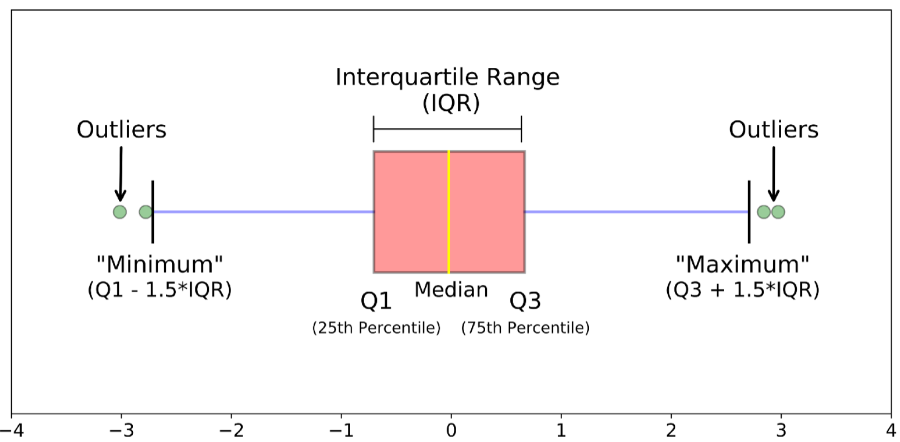

# Visualisierung mit Seaborn 

Seaborn ist eine Visualisierungsbibliothek, die auf Matplotlib aufbaut. Sie liefert eine Vielzahl attraktiv aufbereiteter statistischer Visualisierungen. 

Link: https://seaborn.pydata.org/

Wichtig: Zur Verwendung von Seaborn müssen stets die beiden Befehle in den Importzeilen auftreten.

```python
import matplotlib.pyplot as plt
import seaborn as sns
```


## Swarmplots 

```{python, results="hide"}
import numpy as np
import matplotlib.pyplot as plt
import seaborn as sns

# A. Daten erzeugen/aufbereiten
data = np.random.uniform(1,100, size=500)

# B. Grafik erzeugen und Achsen definieren
sns.set_theme()
sns.set_context("paper")
plt.tight_layout()
(fig, ax) = plt.subplots( figsize=(7,6))
ax.set_title("Swarmplot")

# C.Plotten und anzeigen
sns.swarmplot(x = data)
```
Hinweise:

- Der Befehl `sns.set_theme()` legt steuernde Parameter für den Stil der Grafiken fest.  (Siehe: https://seaborn.pydata.org/generated/seaborn.set_theme.html?highlight=set_theme#seaborn.set_theme)
- Der Befehl `sns.set_context("paper")`  legt weitere Paramater fest, die konkrete Aspekte des Layouts steuern, zum Beispiel die Größe der Zeichen in Beschriftungen. Damit können auch Einstellungen, die bereits mit `sns.set_theme()` festgelegt wurden, geändert werden.  Mögliche Parameter neben "paper" sind “notebook” (Standard), “talk”, und “poster” (Siehe: https://seaborn.pydata.org/generated/seaborn.set_context.html)

## Histogramme

```{python, results="hide"}
import matplotlib.pyplot as plt
import seaborn as sns

# A. Daten erzeugen/aufbereiten
data =  [1, 2, 2, 3,3, 4, 5, 6, 7, 8, 9, 10]

sns.set_theme()
sns.set_context("notebook")
(fig, ax) = plt.subplots( figsize=(7,6))
ax.set_title("Histogram")

sns.histplot(x = data,
             #binwidth=1,
             #bins="auto",
             bins=[0,2,5,7,10],
             kde = False)
```


## Boxplots

Boxplots erlaubt einen schnellen Überblick über die Verteilung von Zahlenfolgen und die Existenz von Ausreissern.

{width=100%}


Zum Verständnis von Boxplots lesen sie bitte https://towardsdatascience.com/understanding-boxplots-5e2df7bcbd51 . Die Verwendung von `sns.boxplot(x = data)`  ist hier dokumentiert: [https://seaborn.pydata.org/generated/seaborn.boxplot.html](https://seaborn.pydata.org/generated/seaborn.boxplot.html)&#x20;

Zur Vertiefung ist empfohlen: [Outliers, Inliers, and Other Surprises that Fly from your Data | Rocket-Powered Data Science (rocketdatascience.org)](http://rocketdatascience.org/?p=473)

```{python, results="hide"}
import matplotlib.pyplot as plt
import numpy as np
import seaborn as sns

data = np.arange(1,101)
data = np.concatenate( (data, [151]) )

percentiles = np.percentile( data , [0,25,50,75,100])
IQR = (percentiles[3] -  percentiles[1])
print( "Percentile         : ", percentiles)
print( "IQR                 : ", IQR)
print( "Upper Outlier Limit : ", percentiles[3] + 1.5*IQR)

sns.set_theme()
sns.set_context("notebook")
(fig, ax) = plt.subplots( figsize=(7,6))
ax.set_title("Histogram")

sns.boxplot(x = data)
```

Ausgabe:
```{python, echo=FALSE}
import matplotlib.pyplot as plt
import numpy as np
import seaborn as sns

data = np.arange(1,101)
data = np.concatenate( (data, [151]) )
percentiles = np.percentile( data , [0,25,50,75,100])
IQR = (percentiles[3] -  percentiles[1])

print( "Percentile         : ", percentiles)
print( "IQR                 : ", IQR)
print( "Upper Outlier Limit : ", percentiles[3] + 1.5*IQR)
sns.boxplot(x = data)
```

Zur Vertiefung ist empfohlen: [Outliers, Inliers, and Other Surprises that Fly from your Data | Rocket-Powered Data Science (rocketdatascience.org)](http://rocketdatascience.org/?p=473)


## Relationplot

Mit den bisherigen Plots haben wir lediglich eine Zahlenfolge (Vektor) visualisiert. Relationplots geben uns Einblicke in den Zusammenhang *zweier* Zahlenfolgen. Zudem können wir über Farbgebung eine drittes meist quatitatives Informationsmerkmal  verarbeiten.

```{python, results="hide"}
import numpy as np
import pandas as pd
import matplotlib.pyplot as plt
import seaborn as sns


df = pd.DataFrame({
    "x"    : [1,2,3,4,5,6,7,8,9,10],
    "y"    : [2,2,2,3,4,5,6,7,7, 7],
    "class": ["C","C","C","A","A","A","B","B","C","C"]
})

sns.set()
sns.set_context("paper", font_scale=2)
(fig,ax) = plt.subplots(figsize=(11, 7))

sns.relplot(data = df, x = "x", y="y",  hue="class", 
  s = 100, # define the size of markers
  height = 7 # define size of plot
)
```

