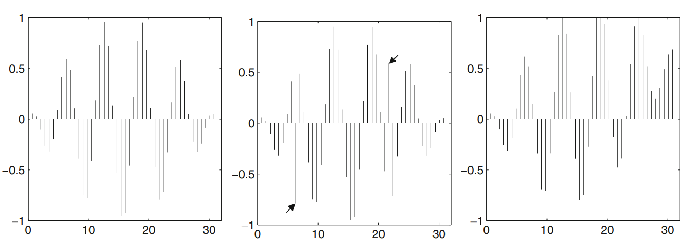

# (PART) Teil C: Preprocessing{-} 

# Datenfehler

## Grundsätzliche Fehlerarten

Bessere Datenqualität wird zu genaueren Ergebnissen führen. 

Mögliche Fehlerquellen: 

- Messtechnisch nicht erfassbare Änderungen des zu messenden Gegenstandes, der Messgeräte, der Umwelt und der Beobachter 
- mangelnde Kalibrierung von Messeinrichtung
- Ablesefehler, Tippfehler
- Übertragungsfehler, Formatfehler (z.B. beim Datum oder bei Zahlen)
- falsche Formeln, falsches Vorzeichen (+ oder -)


## Outliers, Inliers und Drift

Outliers, Inliers und Drift bezeichnen drei wesentlich Arten von Fehlern in Daten.  

### Outliers

Die Webpage  Outliers http://rocketdatascience.org/?p=473, definiert Outliers wie folgt:  "*... when data points are several standard deviations from the mean of your data distribution, these are traditional data outliers. These may signal at least 3 possible causes:* 

*(a) a data measurement problem (in the sensor);* 

*(b) a data processing problem (in the data pipeline); or* 

*(c) an amazing unexpected discovery about your data items. The first two causes are data quality issues that must be addressed and repaired. The latter case (when your data fly outside the bounds of your expectations) is golden and worthy of deeper exploration*"


### Inliers und Drift

Bei Inliers handelt es sich um fehlerhafte Daten, die innerhalb der statistische Verteilung liegen (im Gegensatz zu den Outliers).  Die OECD definieren einen Inlier als: *... a data value that lies in the interior of a statistical distribution and is in error. Because inliers are difficult to distinguish from good data values they are sometimes difficult to find and correct.*^[https://stats.oecd.org/glossary/detail.asp?ID=3464]

Unter Drift versteht man, dass die Messung oder der Gegenstand der Messungen sich langsam und stetig ändern. Als Konsequenz bilden Daten, die für maschinelles Lernen oder die Formulierung von Theorien verwendet  wurden u.U. nicht mehr die tatsächliche Realität abbilden und damit wertlos werden. Gleiches passiert, wenn z.B. Sensoren an Qualität einbüssen.  

{width=100%}


## Missing Data or Invalid Data

Hier handelt es sich um fehlende Daten, z.B. leere oder ungültige Zellen in Excel-Files. Was tun?

Möglichkeiten zum Umgang:

- Verwendung von *invalidity lists*, *invalidity values*

- Korrektur oder Schätzung, z.B.  durch 
  
  - *mean, median, minimum, maximum*
  - *nearest neighbor*
  - *lineare interpolation*
  
- Löschen der Daten


### Missing Values mit Dataframes

Führen Sie [diese Übung](https://datatofish.com/rows-with-nan-pandas-dataframe/)  in Python durch. 

<!--

### Daten laden

Vorbereitung: Laden sie [diese Excel-Datei](https://hawlandshutde-my.sharepoint.com/:x:/g/personal/dgreipl_az_haw-landshut_de/EcE2pm3SLB9LtJ0LVMAmqvIB63H6siSwhBCKifxtQkU8SA?e=4SIbLv) und erstellen Sie eine Kopie auf Google Drive. Laden sie dann die Daten in einen Dataframe mit dem Namen, wie in \@ref(id-load-from-excel) erläutert. 

### Überblick verschaffen  

Verschaffen sie sich mit describe(), info() und der Anzeige ausgehwählter Zeilen einenÜberlick über die Daten.

```{python, echo=FALSE}
#from google.colab import drive
#import pandas as pd
#drive.mount('/content/drive')
#df = pd.read_excel("/content/drive/My Drive/Colab Notebooks/test-#datei.xlsx")
#df
```

### Anzeige von Zeilen mit na-Werten.

### Löschen von Zeilen mit na Werten
Folgender Befehl löscht alle Zeilen mit na-Werten aus dem Dataframe:
```{python, results="hide"}
#df_ohne_na = df.dropna()
#df_ohne_na
```
Ausgabe: 
```{python, echo=FALSE}
#df_ohne_na = df.dropna()
#df_ohne_na
```
-->