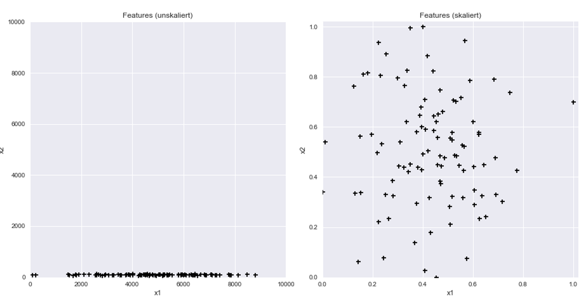
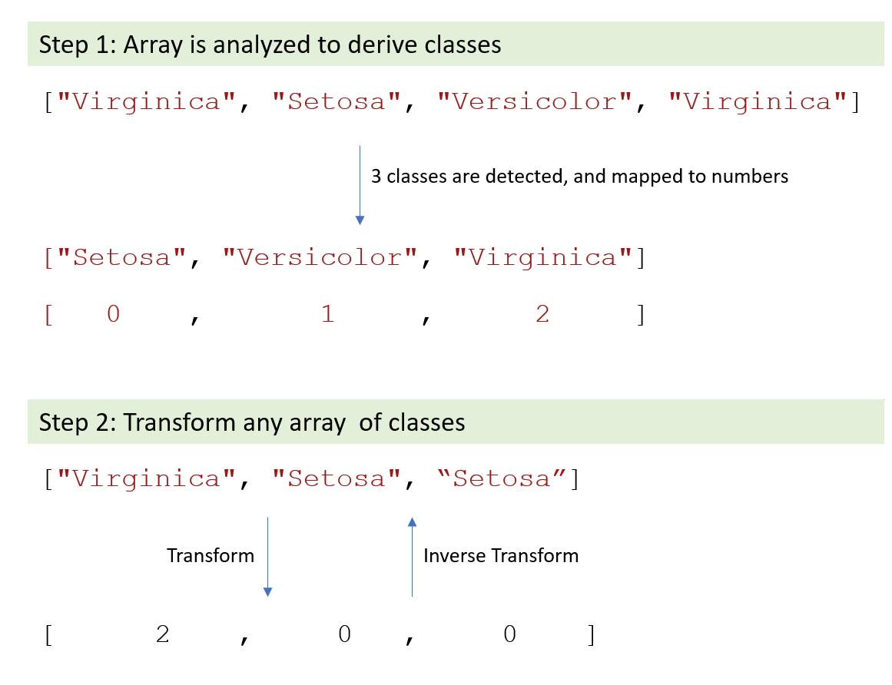
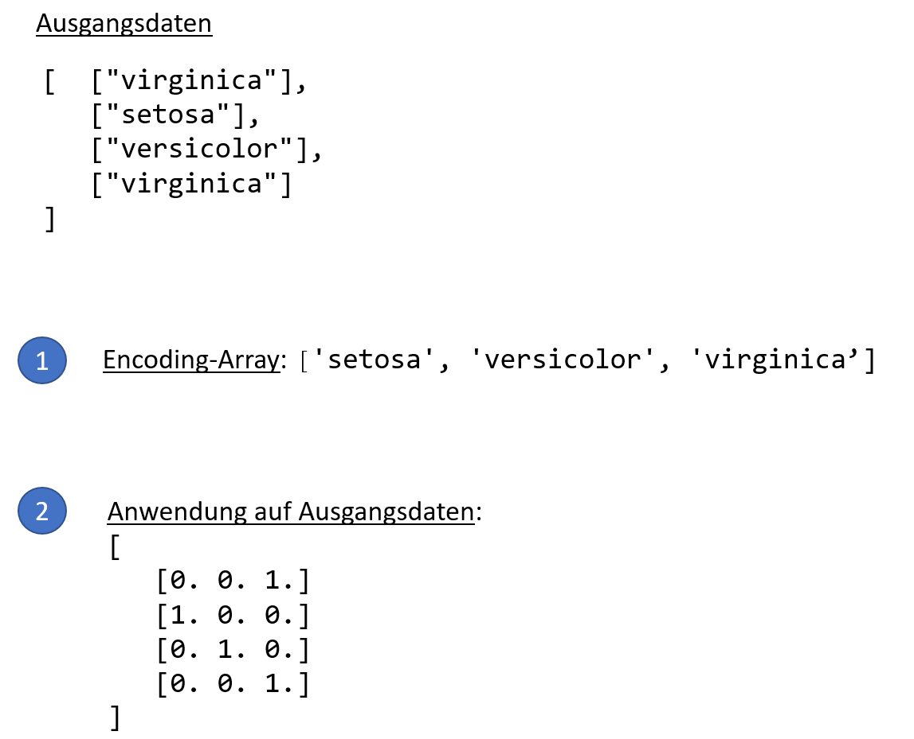

# Datentransformation

Die nachfolgenden Transformation (und ihre Varianten) treten häufig in der Vorverarbeitungsphase auf. Es ist aber stets gut zu überlegen, ob sie sinnvoll sind!

## Feature-Standardisierung (Min-Max-Scaling)

Ziel: Vermeiden extrem unterschiedlicher Wertebereiche verschiedener Featurevektoren

Beispiel: Nehmen wir an, dass in einem Datensatz mit zwei Featurevektoren 

- der erste Featurevektor $x1$ einer Normalverteilung von mit $\mu=5000,\sigma=2000$ entspricht
- der zweite Featurevektor  $x2$  einer Normalverteilung von mit $\mu=100,\sigma=20$ entspricht

Dies kann für numerische Verfahren erhebliche Probleme bereiten. In vielen Fällen macht es Sinn metrische Features wie folgt in den Bereich von [0,1] zu skalieren:
$$
x1_k = \frac{x1_k - x1_{min}}{x1_{max} - x1_{min}}
$$
Verfährt man für den zweiten Featurevektor $x2$ analog, so sieht Plot für skalierte und und unskalierte Daten wie folgt aus:

{width=100%}


#### Python-Code

Hier ist der Python code:

```python
import numpy as np
import matplotlib.pyplot as plt

N = 100
x1 = np.random.normal(5000, 2000, N)
x2 = np.random.normal(100, 20, N)
plt.style.use('seaborn')
fig, ax = plt.subplots(1,2, figsize=(16,7))
fig.tight_layout()
ax[0].set_xlim(0,10000)
ax[0].set_ylim(0,10000)
ax[0].set_aspect('equal')
ax[0].set_xlabel('x1')
ax[0].set_ylabel('x2')
ax[0].set_title('Features (unskaliert)')
ax[0].scatter(x1, x2, marker='+', color='black')
ax[1].set_xlim(0,1.02)
ax[1].set_ylim(0,1.02)
ax[1].set_aspect('equal')
ax[1].set_xlabel('x1')
ax[1].set_ylabel('x2')
ax[1].set_title('Features (skaliert)')
ax[1].scatter((x1 - x1.min())/(x1.max()-x1.min()), (x2 - x2.min())/(x2.max()-x2.min()), marker='+', color='black')

#Anzeigen
plt.show()
```


## Feature-Binning

Wir teilen metrische Daten in Intervalle ein und erhalten so eine ordinale oder gröbere metrische Darstellung.

```{python, results="hide"}
from sklearn.preprocessing import KBinsDiscretizer
import numpy as np

# y muss eine Spaltenform haben, also shape [n,1]
y = np.array([[0],[1],[6],[3],[4],[5],[6],[7],[8],[9],[10]])

est = KBinsDiscretizer(n_bins=4, encode='ordinal', strategy='uniform')
est.fit(y)

print( est.bin_edges_)
yt = est.transform( y )
print(yt)
```
Ausgabe

```{python, echo=FALSE}
from sklearn.preprocessing import KBinsDiscretizer
import numpy as np

# y muss eine Spaltenform haben, also shape [n,1]
y = np.array([[0],[1],[6],[3],[4],[5],[6],[7],[8],[9],[10]])

est = KBinsDiscretizer(n_bins=4, encode='ordinal', strategy='uniform')
est.fit(y)

print( est.bin_edges_)
yt = est.transform( y )
print(yt)
```


## Label-Transformation

{width=100%}

#### Python-Code (`Label-Encoder`){-}

```{python, results="hide"}
import numpy as np
from sklearn.preprocessing import LabelEncoder

le = LabelEncoder()
le.fit( ["Virginica", "Setosa", "Versicolor", "Virginica"] )
print( "Classes : ")
print( le.classes_)

print( "\nEncoding : ")
print( le.transform(["Virginica", "Setosa", "Setosa"]) )

print( "\nInverse Encoding : ")
print( le.inverse_transform([2,0,0]))
```

Output:

```{python, echo=FALSE}
import numpy as np
from sklearn.preprocessing import LabelEncoder

le = LabelEncoder()
le.fit( ["Virginica", "Setosa", "Versicolor", "Virginica"] )
print( "Classes : ")
print( le.classes_)

print( "\nEncoding : ")
print( le.transform(["Virginica", "Setosa", "Setosa"]) )

print( "\nInverse Encoding : ")
print( le.inverse_transform([2,0,0]))
```

## One-Hot Encoding

One-Hot-Encoding ist eine Methode, um kategorische Daten als binäre Vektoren darzustellen. Folgende Grafik verdeutlicht die Methode und illustriert den Namen. One-Hot-Encoding funktioniert in folgenden beiden Schritten:

1. Extrahiere aus einem Feature/Label die auftretenden Kategorie-Werte

2. Transformiere den/die Kategorie-Wert/e in einen Vektor.

   

#### Einfaches Beispiel{-}

{width=70%}

Glücklicherweise gibt es einen Funktion in `sklearn`, die das für uns erledigt. Folgender Code sollte einfach zu verstehen sein (Beachten sie aber die shapes!):

```{python, results="hide"}
from sklearn.preprocessing import OneHotEncoder

y = np.array([  ["virginica"], 
                ["setosa"], 
                ["versicolor"], 
                ["virginica"]
            ])

enc = OneHotEncoder(sparse=False)

# Beachten sie den shape der Eingabe zu enc.fit: (4,1)!
enc.fit( y )

print("\nShape von der Daten: \n", y.shape)
print("\nKategorien         : \n", enc.categories_) # Note: Typ ist Liste!

# Transformieren einer nominalen Feature-Matrix
print("\nOne-Hot-Encoding von ['virginica'] : \n", enc.transform( y ) )
```
Ausgabe:
```{python, echo=FALSE}
from sklearn.preprocessing import OneHotEncoder

y = np.array([  ["virginica"], 
                ["setosa"], 
                ["versicolor"], 
                ["virginica"]
            ])

enc = OneHotEncoder(sparse=False)

# Beachten sie den shape der Eingabe zu enc.fit: (4,1)!
enc.fit( y )

print("\nShape von der Daten: \n", y.shape)
print("\nKategorien         : \n", enc.categories_) # Note: Typ ist Liste!

# Transformieren eines Wertes
#print("\nOne-Hot-Encoding von ['virginica'] : \n", enc.transform( [['virginica'], ['setosa']] ) )
print("\nOne-Hot-Encoding von ['virginica'] : \n", enc.transform( y ) )
```


## Übung

### One-Hot-Encoding für Ziffern

Versuchen Sie  eine One-Hot-Encoder für Ziffern zu erstellen, also 

0 -> [1, 0, 0, 0, 0, 0, 0, 0, 0, 0]

3 -> [0, 0, 0, 1, 0, 0, 0, 0, 0, 0]


### Komplexes Beispiel

Versuchen Sie  die Anwendung des Encodings auf ein komplexeres Beispiel zu verstehen:

```{python, results="hide"}
from sklearn.preprocessing import OneHotEncoder

y = np.array([
    ['A','B'], 
    ['B','A'], 
    ['A','Z'], 
    ['B','Z'], 
    ['A','Z']
    ])


enc = OneHotEncoder(sparse=False)

# Beachten sie den shape der Eingabe zu enc.fit: (4,2)!
enc.fit( y )

print("\nKategorien: \n", enc.categories_)

# Transformieren eines Wertes - Beachten sie den shape!
print("\nOne-Hot-Encoding von [A,Z] : \n", enc.transform( [['A','Z']] ) )
```

Ausgabe:

```{python, echo=FALSE}
from sklearn.preprocessing import OneHotEncoder

y = np.array([
    ['A','B'], 
    ['B','A'], 
    ['A','Z'], 
    ['B','Z'], 
    ['A','Z']
    ])


enc = OneHotEncoder(sparse=False)

# Beachten sie den shape der Eingabe zu enc.fit: (4,2)!
enc.fit( y )

print("\nKategorien: \n", enc.categories_)

# Transformieren eines Wertes - Beachten sie den shape!
print("\nOne-Hot-Encoding von [A,Z] : \n", enc.transform( [['A','Z']] ) )
```


