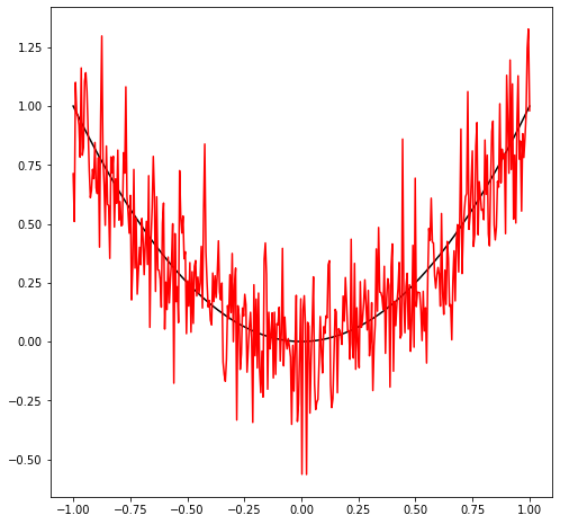
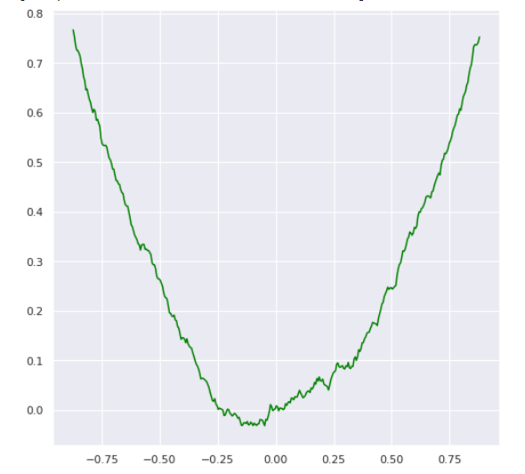

# Filterung

Filterung modifiziert Werte aus unserem Datensatz. Wir betrachten untern den zahlreichen Filteransätzen lediglich die Glättung von Werte durch Moving Average Techniken.

## Moving Average mit Python

```
import pandas as pd
import numpy as np
import matplotlib.pyplot as plt

N = 400
x = np.linspace(-1,1,N)
e = np.random.normal(size=N)
y = x*x + 0.2 * e
fig = plt.figure(figsize=(8,8))
plt.plot( x, x*x, color="black", linestyle='-')
plt.plot( x, y, color="red", linestyle='-'
```



Wir glätten nun die Daten mit einem Moving Average Verfahren.

```
y_filtered = pd.Series(y).rolling(window=50, center=True).mean()
plt.plot( x, y_filtered, color="green", linestyle='-')
```

Ergebnis:



