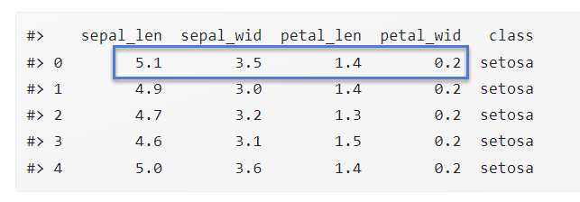
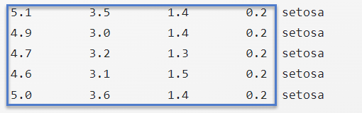
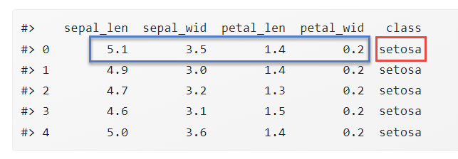

# (PART) Teil D: Maschinelles Lernen {-}

# Grundbegriffe

## Feature Matrix

### Numerisches Feature (Merkmal)

> Ein numerisches Feature ist ein **Einzelaspekt **einer Beobachtung oder Messung unserer Objekte, der sich als Zahl ausdrücken lässt.

Ein Beispiel aus dem Iris-Datensatz ist  "Länge der Petalums".  Die Anzahl der Features einer Problemstellung nennen notieren wir mit dem Buchstaben $m$. Bei Iris: $m = 4.$&#x20;

### Feature-Vektor (Merkmals-Vektor)

Feature-Vektor ist eine Gruppierung der konkreten gemessenen Werte der numerischen Features als Vektor. Diese Gruppierung notiert man in der Regel als Zeilenvektor $\bf{x} \in \mathbb{R}^{m}$.&#x20; Ein Beispiel aus dem Iris-Datensatz ist der (erste) Feature-Vektor
$$
\textbf{x}= (5.1, 3.5, 1.4, 0.2 ) \in \mathbb{R}^4
$$

In nachfolgender Abbildung ist dieser Feature-Vektor farbig markiert.

Alternative Namen für den Feature-Vektor sind 

- Merkmals-Vektor
- Example
- Sample

### Feature-Matrix (Datensatz, Feature-Set)

Ein Datensatz (Feature-Set) $X$ ist eine (endliche) Menge von Feature-Vektoren gleicher Dimension $m$. Die Anzahl der Feature-Vektoren im Datensatz bezeichnen wir stets mit dem Buchstaben  $n$.&#x20; Wir indizieren mit einer hochgestellten Zahl in runden Klammern, um Verwechslungen mit einem Vektorelement zu vermeiden.
$$
\textbf{X} = \{\bf{x^{(1)}}, \ldots \bf{x^{(n)}}\} \subset \mathbb{R}^m
$$

Eine Feature-Matrix besteht aus n Feature-Vektoren, die die Zeilen der Spalten bilden. Wir notieren die Feature-Matrix ebenfalls mit dem Symbol $X$. 

Dann ist:

$$
\textbf{X} \in \mathbb{R}^{n \times m}
$$

Beispiel Iris:  Die Feature-Matrix $X \in \mathbb{R}^{150 \times 4}$  für Iris ist nachfolgend in farbig hinterlegt.&#x20;

## Label und Labeled Example

Zu jedem Feature-Vektor interessiert uns eine "Antwort"  oder ein "Ergebnis". Zum Beispiel fragen wir danach, zu welcher Gattung die Lilie mit dem Feature-Vektor $\textbf{x}= (5, 3.6, 1.4, 0.2 )$ gehört. Diese Information nennen wir **Label** zum Feature-Vektor $\bf{x}$. Nachfolgende Abbildung zeigt eine featrure-Vektor und den zugehörigen Label.

 

Wir bezeichnen den Label stets mit dem Buchstaben $\bf{y}$. Notieren wir den Feature-Vektor mit  $\bf{x^{(i)}}$, so schreiben wir $\bf{y_i}$ für den zugehörigen Label.  Der Label kann ein Vektor oder auch nur eine Zahl sein.  

{width=100%}

## Machine Learning (ML)

Wir definieren zwei wichtige Begriffe:

#### Machine Learning{-}

*Machine Learning* bezeichnet ein Programm oder System, das 

- mittels Analyse eines vorliegenden Datensatzes durch einen Algorithmus (mit menschlicher Hilfe) konstruiert wird und 
- aus einem Feature-Vektor in nützlicher Qualität Labels ableitet, die wir als *korrekt* bezeichnen.

#### Supervised und unsupervised learning{-}

Enthält der Datensatz auch Labels so sprechen wir von *Supervised Learning*, andernfalls von *Unsupervised Learning*. 

## Problemstellung

Wie in vorhergehendem Abschnitt bereits beschrieben, suchen wir ein Programm, das zu einem Feature-Vektor in möglichst hoher Genauigkeit (manchmal sprechen wir auch von  *möglichst kleinem Fehler*) ein korrektes Ergebnis (*Label*) bestimmt .

Um die Problemstellung zu lösen, verwenden wir einen Lernalgorithmus, die aus (meist vielen) exemplarischen Feature-Vektoren und zugehörigen Labels ein Programm zur Problemlösung erstellt. Das konkrete Programm zur Problemlösung erzeugt also ein Lernalgorithmus, nicht ein Programmierer.  (Gleichwohl stellt ein Mensch immer noch wesentliche Weichen für dieses Verfahren). Wir sagen, dass der Computer aus den gegebenen Daten _lernt_, ein Programm zur Problemlösung zu erstellen. Deshalb nennt man diesen Ansatz auch allgemein **Maschinelles Lernen.** 

## Modell (Model) und Prediction

Ein **Modell **_M_ ist eine Repräsentation des Programms, das einem Feature-Vektor x einen Label y zuordnet, aus der Menge der zulässigen Ergebnisse $Y$ zuordnet:

$$
M: \mathbb{R}^m \rightarrow Y \\ M(x) = y
$$

 Jedes Modell ist grundsätzlich eine Lösung der Aufgabenstellung (wobei es gute und schlechte Lösungen gibt..). Für *Iris* wäre der Ansatz, jedem Feature-Vektor $x$ die Blumenart *Versicolor* zuzuordnen, ein Modell - wenn auch kein besonders gutes.

Der Wert $M(x)$ heißt auch **Vorhersage ** oder **Prediction** des Modells $M$ für den Feature-Vektor $x$. Ein Modell ist also dann "gut", wenn die Vorhersage  $M(x)$ möglichst oft dem erwarteten Ergebnis entspricht oder nahe daran liegt. 

## Klassifikation

Besteht die Ergebnismenge Y aus $k$ Elementen , also z.B.  $Y = \{0, \dots,k-1\}$, ( $k \geq 2)$ . So spricht man von  einem **Klassifikationsproblem**. Die zugehörige Problemstellung heißt Klassifikationsproblem.

Die Menge der Klassen, also  $k$, liegt meist in einstelligen oder unteren zweistelligen Bereich. Für den Spezialfall $k=2$ sprechen wir von **binärer Klassifikation**. 

Iris ist ein Beispiel für ein Klassifikationsproblem mit $k= 3$.

### Accuracy

Für **Klassifikation** definieren wir die Qualität des Verfahrens durch den Anteil der korrekt klassifizierten Eingaben, also

$$
\frac{\text{Anzahl der korrekten Vorhersagen}}{\text{Anzahl der Examples}}=\frac{| \{ x_i, \text {mit }M(x_i) = y_i\}|}{n}
$$

Beachten Sie, dass wir die Accuracy nicht unbedingt auf der Basis des <u>gesamten</u> Datensatzes $X$ bestimmen werden. Sinnvoller ist  die Berechnung anhand von Examples , die das Verfahren noch nie vorher gesehen hat. Dazu später mehr...

## Regression {#regr}

Enthält  $Y$ sehr viele mögliche *numerische* Werte, z.B. $Y = \mathbb{R}$, weil die Labels quantitative Daten sind, so spricht man von einem  **Regressionsproblem**. 

### Loss

Um zu bewerten, wie gut (oder schlecht) ein Modell ist, messen wir für einen Datensatz $(X,y)$, wie weit die Vorhersagen von den Labels abweichen. Man verwendet zum Beispiel für Regressionsprobleme in der Regel den sogenannten *mean squared error* (MSE):

$$
\text{MSE}(M,X,y) = \frac{1}{n}\sum_{i=0}^{n-1} (M(x_i) - y_i)^2
$$

## Modellfamilie

Man kann sich leicht überlegen, dass es sehr, sehr viele Modelle zu einem Datensatz gibt. Um mit dieser Vielfalt umzugehen, betrachtet man eine _Modellfamilie_, also eine konkrete Menge passender Modelle, die von Parametern definiert wird. Das zu einem Parameter $p$ gehörige Modell nennen wir $M_p$ . Hört sich recht schwierig an, daher ein Iris-Beispiel, bei dem  $p$ eine positive reelle Zahl ist.

$$
M_p(x) = \left\{
\begin{array}{ll}
{\text{versicolor}} & \text{falls } x_{\text{petal\_len}} \leq p \\
{\text{virginica}} & \, \textrm{sonst} \\
\end{array}
\right.
$$

Dabei bezeichnet $x_{\text{petal\_len}}$ den Wert für *petal_len* aus der Eingabe $x$. Wir machen also die Vorhersage von nur von $x_{\text{petal\_len}}$ abhängig.

Wir picken zwei Modelle aus der Modellfamilie heraus: Das Modell $M_{100}$ wird jede Lilie als [versicolor]() klassifizieren. Das Modell $M_{0.2}$  hat schon eine bessere Genauigkeit (Warum?)  Irgendwie scheint $M_{0.2}$ besser zu funktionieren als $M_{100}$. 

## Definition Machine-Learning

Gegeben sein ein  Datensatz, also eine Feature-Matrix $X$ und einen Label-Vektor  $y$ . Unter **Ma*schine Learning*** versteht man einen Algorithmus, der aus einer Modellfamilie ein konkretes Modell mit möglichst geringen Loss (oder hoher Accuracy) errechnet.

 

