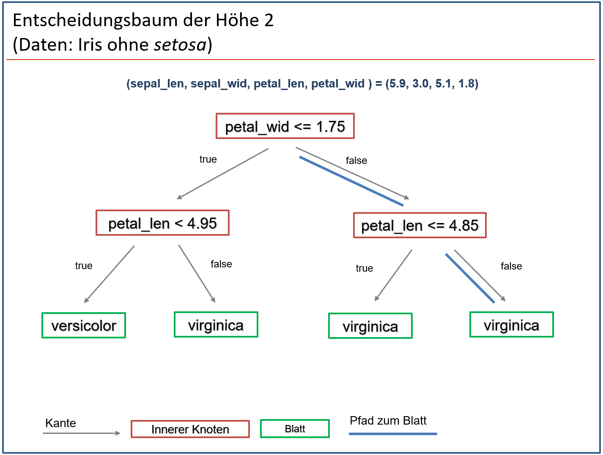
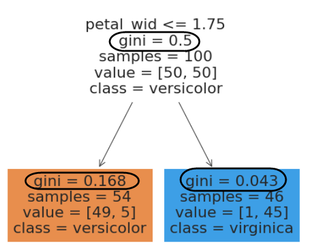

# Decision Trees

Wir versuchen als ML-Modell einen Entscheidungsbaum (decison tree) zu konstruieren, der entlang von Werten Feature-Werten aufgebaut ist.  

## Aufbau

Der Aufbau eines Entscheidungsbaumes ist recht einfach entlang des folgenden Beispiels zu verstehen.

{width=100%}

Nachfolgende Eigenschaften beschreiben einen binären Entscheidungsbaum:

- Ein binärer Entscheidungsbaum besteht aus mindestens einem **Knoten** (node). Dieser Knoten heißt **Wurzel** (root). 

- Jeder Knoten hat entweder zwei **Nachfolgeknoten** (linker und rechter Nachfolgeknoten) oder keinen Nachfolgeknoten. Außer der Wurzel ist jeder Knoten ein Nachfolgeknoten genau eines anderen Knoten.  

- Ein Knoten ist mit einem Nachfolgeknoten über eine **Kante** verbunden. Die **Tiefe eines Knotens** gibt an, wie viele Kanten er von der  Wurzel entfernt ist.

- Ein **Pfad** ist eine geordnete Liste von Knoten, die durch Kanten verbunden sind 

- Ein Knoten ohne Nachfolgeknoten heißt **Blatt**, andernfalls **innerer Knoten**,

- Jeder innere Knoten enthält genau eine **Bedingung**, also eine Abfrage, die mit *wahr* oder *falsch* zu beantworten ist. (im ML Kontext:  auf Basis *eines* Feature-Wertes.)

- Jedem Blatt ist genau eine **Klasse** (label) zugeordnet.

- Die **Baumhöhe** (engl. *tree depth*) ist die maximal auftretende Tiefe eines Knotens. 

  

 

## Prediction

Ein Entscheidungsbaum erlaubt auf folgende Weise eine *Prediction* für einen Feature-Vektor:

- Die Wurzel erhält den Feature-Vektor als Eingabe.  

- Der Feature-Vektor definiert gemäß dem Ergebnis der Abfrage im jeweiligen Knoten (wahr: linker Knoten, falsch: rechter Knoten)  einen Pfad bis zu einem Blatt.
- Die diesem Blatt zugeordnete Klasse (label) ist die *Prediction* für den Feature-Vektor. 


{width=100%}


## Konstruktion  

Zur Vereinfachung wählen wir im folgenden Beispiel nur *versicolor*- und *viriginica*-Datensätze aus, arbeiten also mit zwei Klassen und 100 Datensätzen. Hierzu bauen wir einen möglichen Entscheidungsbaum der Höhe 1. Wir gehen in zwei Schritten vor:

##### Schritt 1: Abfragen festlegen{-} 

Wir legen die Abfrage in jedem inneren Knoten fest (das ist für die Höhe 1 einfach, weil wir nur einen inneren Knoten haben). In *nachfolgendem* Beispiel:  petal_len <=4

##### Schritt 2: Predictions festlegen{-}

Dieser Schritt ist etwas anpruchsvoller: Wir lassen alle Datensätze - wie oben erläutert - durch einen Pfad bis zu einem Blatt laufen. In jedem Knoten auf dem Pfad zählen wir, 

- wie viele Datensätze durch den Knoten gelaufen sind und
- welche Klasse (label) sie jeweils hatten (damit entsteht in dem Knoten eine *Zerlegung* der Menge; wir brauchen den Begriff weiter unten).

Schließlich legen wir *für jedes Blatt* die Klasse mit dem höchsten Zählwert als Prediction fest. 


### Beispiel

Nachfolgend finden Sie entsprechenden Baum.  Im Wurzelknoten kommen alle 100 Datensätze an, 50 davon mit dem Label *versicolor* und 50 mit dem Label *viriginica*. Offensichtlich werden im linken Blatt 16 Datensätze, im rechte Blatt 50 Datensätze richtig klassifiziert. Das ergibt eine Genauigkeit von 66%.


{width=100%}

Sie können die Zahlen aus obigem Entscheidungsbaum mit Excel nachvollziehen oder - schneller - mit folgenden kleinen Programmen berechnen.


### Python (Iris mit zwei Arten)

Wir wählen zuerst nur die beiden Klassen *versicolor* und *viriginca* aus. Die letzte Zeile des folgenden Programms ist entscheidend. Der Rest unterscheidet sich nicht vom bereits bekannten Ladevorgang.

##### Modifiziertes Laden der Daten{-}

```{python}
import pandas as pd
from sklearn import datasets

iris = datasets.load_iris()
iris_df = pd.DataFrame(iris.data)
iris_df['class']=iris.target_names[iris.target ]
iris_df.columns=['sepal_len', 'sepal_wid', 'petal_len', 'petal_wid', 'class']
iris_df = iris_df[50:]
```

##### Zählen der Datensätze pro Klasse{-}

Mit folgenden Programmzeilen lassen sich die nötigen Werte schnell berechnen:

```{python, results="hide"}
filter_crit = (iris_df["petal_len"] <= 4)
filter_ver  = (iris_df["class"] == "versicolor")
filter_vir  = (iris_df["class"] == "virginica")

print( "Total      : ", iris_df[ filter_crit]["class"].count() )
print( "Versicolor : ", iris_df[ filter_crit & filter_ver]["class"].count() )
print( "Virginica  : ", iris_df[ filter_crit & filter_vir]["class"].count() )
```
Ausgabe:
```{python, echo=FALSE}
filter_crit = (iris_df["petal_len"] <= 4)
filter_ver  = (iris_df["class"] == "versicolor")
filter_vir  = (iris_df["class"] == "virginica")

print( "Total      : ", iris_df[ filter_crit]["class"].count() )
print( "Versicolor : ", iris_df[ filter_crit & filter_ver]["class"].count() )
print( "Virginica  : ", iris_df[ filter_crit & filter_vir]["class"].count() )
```


## Übung 1

Versuchen Sie, einen besseren Baum der Höhe 1 zu finden! Erstellen Sie eine (handschriftliche) Grafik, wie in obiger Abbildung.


## Modellfamilie und Lernverfahren

### Modellfamilie

In diesem Abschnitt geht es um die Frage, wie wir den besten Baum finden. Dazu definieren wir zunächst unsere **Modellfamilie**: wir betrachten alle binären Entscheidungsbäume der Höhe 1. Das hört sich zunächst recht übersichtlich an, allerdings gibt bereits mehr als 90 sinnvolle Bäume der Höhe 1. (Und später werden wir die Höhe noch ändern!) 

Als Lernverfahren könnten sie nun alle Entscheidungsbäume aus der Modellfamilie bauen, die Genauigkeit ausrechnen und dann den besten Baum aussuchen. In der Theorie funktioniert das, in der Praxis nur schlecht,  weil die Anzahl der möglichen Bäume mit der Baumhöhe förmlich explodiert. Es ist also keine gute Idee alle Bäume zu bauen und dann denjenigen mit der besten Genauigkeit auszuwählen.


### Übung 2

- Was könnte man unter einem *sinnvollen Baum* verstehen? (Hinweis: Was ist ein *nicht sinnvoller Knoten*? )

- Wie würden sie die Anzahl der möglichen sinnvollen Bäume der Höhe 1 berechnen?

  

### Optimaler Baum nach Training

Wir berechnen den besten Baum mit Python. Hier  der Code und danach der Plot des Baumes. (Hinweis: Die mit #> beginnenden Zeilen zeigen die Ausgabe des vorhergehenden print Befehls.)

```{python}
import pandas as pd

from matplotlib import pyplot as plt
import seaborn as sns

from sklearn import datasets
from sklearn.tree import DecisionTreeClassifier 
from sklearn import tree

iris = datasets.load_iris()
iris_df = pd.DataFrame(iris.data)
iris_df['class']=iris.target_names[iris.target ]
iris_df.columns=['sepal_len', 'sepal_wid', 'petal_len', 'petal_wid', 'class']
iris_df = iris_df[50:]

X = iris_df.sample(frac=1).reset_index(drop=True)
y = X['class']
X = X.drop(['class'], axis=1)

print(f'\nShape of Feature Matrix : {X.shape}')
print(f'\nShape of Labels : {X.shape}')

clf = DecisionTreeClassifier(random_state=1234, criterion = 'gini', max_depth=1)
model = clf.fit(X, y)

fig = plt.figure(figsize=(6,5))
p = tree.plot_tree(clf
                   , feature_names=X.columns
                   , class_names=['versicolor', 'virginica']
                   , filled=True
                   )
plt.show()
```


  {width=60%}


### Übung 3

1. Berechnen sie die Werte in den Knoten mit dem Phython-Programm aus dem vorhergehenden Abschnitt.
2. Welche *Accuracy* hat dieser Baum?


### Gute Bäume konstruieren

Wir haben oben beobachtet, dass Blätter dann wenige Fehler produzieren, wenn ihre Klassenverteilung (*Zerlegung*) möglichst "rein" ist. Am besten ist, wenn all Features in einer Klasse landen, weil wir dann in diesem Blatt keinen Fehler für unseren Datensatz erzeugen. Wir versuchen also die Güte eines Blattes anhand der "Reinheit" seiner Klassenaufteilung zu berechnen. Hierzu verwendet man die sogenannte *Gini-Impurity*.


### Zerlegung

Für eine endliche Menge $S$  heißen die Teilmengen $S_1, S_2,...S_k$  Zerlegung, wenn jedes Element aus $S$ in genau einer der Teilmengen enthalten ist.

Wie man an obigem Beispiel sieht, lässt sich jedem Knoten eine Zerlegung derjenigen Datensätze zuordnen, die den Baum in der Trainingsphase durchfließen. In einem Blatt wünschen wir uns, dass *eine* der k Teilmengen, möglichst viele Elemente enthält. Im besten Fall enthält diese eine Menge alle Elemente und die anderen sind $k-1$ Mengen leer!


### Gini-Impurity einer Zerlegung

Nehmen Sie an, dass eine Menge S  in Teilmengen $S_1, S_2,...S_k$  zerlegt wird (und damit den Elementen einer Teilmengen jeweils ein Label zugeordnet ist.) Mit  $p_i$  bezeichnen wir jeweils das Verhältnis der Elemente  von $S_i$ im Vergleich zu $S$. Wegen $\sum p_i = 1$ definiert $P = (p_1, p_2, ...,p_n)$ eine (diskrete) Verteilungsfunktion. 

Wir wählen nun aus Menge $S$  zufällig  Elemente aus. Für jedes gewählte Element raten wir, zu welcher Teilmenge es gehört. Beim Raten halten wir die obige Verteilungsfunktion ein. Wie hoch ist die Wahrscheinlichkeit (die wir im folgenden GINI nennen), *dass wir falsch raten*? Oder anders ausgedrückt: Wie hoch ist die Wahrscheinlichkeit, dass wir ein zufällig gezogenes Sample falsch klassifizieren?

Offensichtlich ist für $k=2$ und $P = (p_1,p_2)$:
$$
\begin{align}
\text{GINI}(p_1, p_2) \quad 
& = \quad p_1 \cdot (1-p_1) + p_2 \cdot (1-p_2) \\
& = \quad p_1 - p_1^2 + p_2 - p_2^2 \\
& = \quad 1 - p_1^2 - p_2^2
\end{align}
$$
wegen $p_1 + p_2 = 1$.


 

### Beispiel ($k=2$)

{width=100%}

Obige Menge von 10 Zahlen lässt sich ein Teilmenge $S_1$ der blauen Werte und eine weitere Teilmenge $S_2$ der roten Werte aufteilen. Damit ergibt sich $p_1 = 0.6$ und $p_2 = 0.4$, also
$$
GINI(P) = 1 - 0.36 - 0.16 = 0.48
$$

### Übung 4

Versuchen Sie für die Zerlegungen der Knoten in nachfolgendem Entscheidungsbaum die GINI-Werte manuell zu berechnen:

{width=60%}


###  GINI-plot für $k=2$

Für $k=2$ und $P = (p_1,p_2)$ ist wegen $(p_1 + p_2)^2 = 1$ und $p_2 = 1-p_1$  
$$
\text{GINI}(p_1, p_2) = 2p_1 \cdot (1-p_1)
$$
Offensichtlich gilt
$$
\text{GINI}(0,1) = \text{GINI}(1,0) = 0 \quad\quad \text{und} \quad\quad \text{GINI}(\frac{1}{2}, \frac{1}{2}) = \frac{1}{2}
$$
Folgende Abbildung zeigt den Plot von $p \rightarrow 2p(1-p)$:

{width=80%}

Je größer der GINI-Wert ist, desto "unreiner" ist die Zerlegung. Man spricht deshalb auch von GINI-*Impurity*.


### GINI-Impurity für eine allgemeinen Zerlegung

Nehmen wir nun an, dass eine endliche Menge S  in $k$ Teilmengen $S_1, S_2,...S_k$  zerlegt wird. Mit  $p_i$  bezeichnen wir weiterhin das Verhältnis der Anzahl der Elemente  von $S_i$ im Vergleich zu $S$. Wegen $\sum p_i = 1$ definiert $(p_1, p_2, ... p_n)$ eine (diskrete) Verteilungsfunktion. Definieren wir die Impurity von $S$ wie oben, als die Wahrscheinlichkeit der Fehlklassifikation eines beliebigen Elementes von $S$, so gilt


$$
\begin{align}\text{GINI}(p_1, \dots, p_k) \quad & = \quad \sum_{i=1}^k p_i \cdot \sum_{j \neq i} p_j \\
& = \quad \sum_{i=1}^k (p_i \cdot  (1-p_i)) \\
& = \quad \sum_{i=1}^k (p_i -  p_i^2 ) \\
& = \quad \sum_{i=1}^k p_i - \sum_{i=1}^k p_i^2  \\
& = \quad 1 - \sum_{i=1}^k p_i^2
\end{align}
$$


### Qualität eines Splits

In einem Baum führt  **innerer Knoten** zu einer Aufteilung der Samples dieses Knoten in zwei Teilmengen, die linke Menge $S_L$ und die rechte Menge $S_R$.

{width=100%} 

Für beide Mengen lässt sich der GINI-Wert ausrechnen:
$$
\text{GINI}(S_L) = 0  \quad \text{und} \quad \text{GINI}(S_R) = \frac{8}{25} =  0.32
$$
Der **erwartete** GINI-Wert des Split ist damit:
$$
\text{GINI} = \frac{1}{2} \cdot \text{GINI}(S_L) + \frac{1}{2} \cdot \text{GINI}(S_R) = \frac{4}{25} = 0.16
$$
Der Split reduziert also die erwartete GINI-Impurity  von $0.5$ auf $0.16$.  Damit wird die Grundidee des Verfahrens erkennbar: jeder Split soll die erwartete GINI-Impurity möglichst stark reduzieren. 


### Übung 5

Berechnen sie die Qualität der folgenden Splits.

**Split 1:**

{width=100%}**Split 2:**

### {width=100%}Übung 6

Wir haben in diesem Abschnitt zwei Bäume der Höhe 1 kennengelernt. Hierzu finden sie nachfolgend die Graphen nochmals dargestellt. Berechnen sie für beide Bäume die Split-Qualität des Wurzelknotens. Am besten bauen Sie dazu eine kleine Excel-Datei und geben die Werte ein.


{width=100%}

-----


<!--

{width=100%}

-->

Die obige Übung sollte uns auf eine Idee bringen: Wir wählen die Abfrage im Wurzelknoten so, dass der GINI-Wert der Zerlegung möglichst klein wird.


### Übung 7 (Baum der Höhe 2)

Versuchen Sie abschließend eine möglichst guten Entscheidungsbaum der Höhe 2 für **alle drei Arten** zu bauen. Skizzieren sie den Baum (Achtung: Nachfolgende Grafik dient der Orientierung. Ihr Baum darf auch eine andere Form haben!)

{width=100%}

