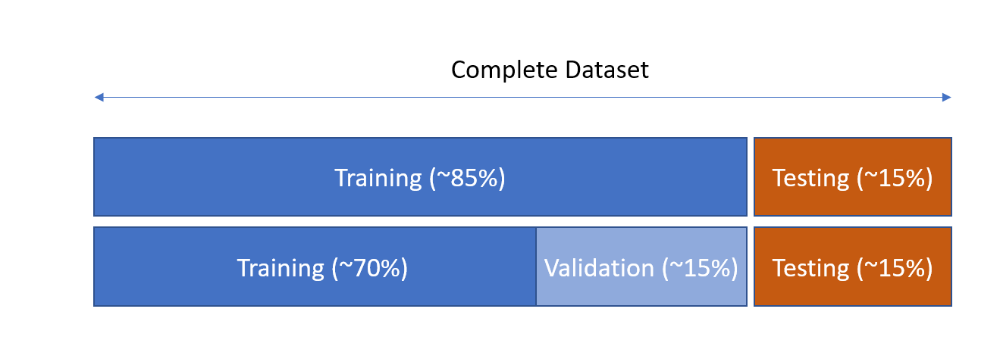
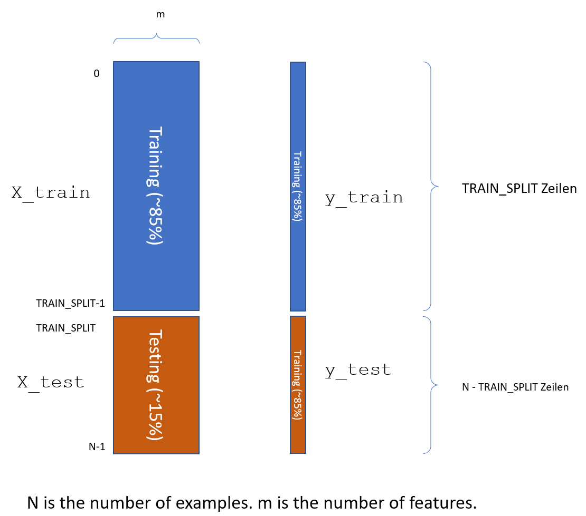

# Training-, Test und Validation-Set

## Aufteilung in Training-Set und Test-Set

Wir teilen unseren Datensatz in einen Trainings-Set und einen Test-Set auf (Wir ignorieren für den Moment den Validation-Set.)

{width=100%}

Wir verwenden im weiteren stets folgende Variablenbezeichner:

| Menge       | Beschreibung                                                 |
| ----------- | ------------------------------------------------------------ |
| X_train     | Dataframe mit Feature-Vektoren der Trainings-Set             |
| y_train     | Dataframe mit Label-Vektor des Trainings-Sets                |
| X_test      | Dataframe mit Feature-Vektoren der Test-Sets                 |
| y_test      | Dataframe mit Label-Vektor des Trainings-Sets                |
| y_pred      | Vorhersage des Modells für  Feature-vektor x                 |
| TRAIN_SPLIT | Anzahl der Examples im Training-Set, der Rest geht zum Test-Set |


## Iris-Decison-Tree mit Train/Test-Set

Wir wiederholen nun das Training unter Verwendung von Training-Set und Test-Set. Nachfolgende Grafik verdeutlicht die Aufteilung und  illustriert die Verwendung der Variablennamen im darauffolgenden Python-Code. Wir nutzen hier noch keine Validierung. Die Variable TRAIN_SPLIT enthält die Anzahl der Examples aus dem Training-Set.

### Aufteilung in Training- und Test-Set

{width=100%}

Wir realisieren die Aufteilung in folgendem Python-Programm:

```{python, results="hide"}
import pandas as pd
from matplotlib import pyplot as plt
import seaborn as sns
from sklearn import datasets
from sklearn.tree import DecisionTreeClassifier 
from sklearn import tree

iris = datasets.load_iris()
iris_df = pd.DataFrame(iris.data)
iris_df['class']=iris.target_names[iris.target ]
iris_df.columns=['sepal_len', 'sepal_wid', 'petal_len', 'petal_wid', 'class']

X = iris_df.sample(frac=1, random_state=1).reset_index(drop=True)
TRAIN_SPLIT = 100

# Trainingsdaten
X_train = X[0:TRAIN_SPLIT]
y_train = X_train['class']

# Achtung, neu: drop löscht eine Spalte aus einem Dataframe
X_train = X_train.drop(['class'], axis=1)
print( X_train.head())

# Testdaten
X_test = X[TRAIN_SPLIT:]
y_test = X_test['class']
X_test = X_test.drop(['class'], axis=1)

print(f'Shape of Training-Data   : {X_train.shape}')
print(f'Shape of Test-Data       : {X_test.shape}')
print(f'Shape of Training-Labels : {y_train.shape}')
print(f'Labels Count in Train-Set:\n{X[0:TRAIN_SPLIT]["class"].value_counts()}')

```
Ausgabe:
```{python, echo=FALSE}
import pandas as pd

from matplotlib import pyplot as plt
import seaborn as sns

from sklearn import datasets
from sklearn.tree import DecisionTreeClassifier 
from sklearn import tree

iris = datasets.load_iris()
iris_df = pd.DataFrame(iris.data)
iris_df['class']=iris.target_names[iris.target ]
iris_df.columns=['sepal_len', 'sepal_wid', 'petal_len', 'petal_wid', 'class']

X = iris_df.sample(frac=1, random_state=1).reset_index(drop=True)

TRAIN_SPLIT = 100

# Trainingsdaten
X_train = X[0:TRAIN_SPLIT]
y_train = X_train['class']
# Achtung, neu: drop löscht eine Spalte aus einem Dataframe
X_train = X_train.drop(['class'], axis=1)
print( X_train.head())

# Testdaten
X_test = X[TRAIN_SPLIT:]
y_test = X_test['class']
X_test = X_test.drop(['class'], axis=1)

print(f'Shape of Training-Data      : {X_train.shape}')
print(f'Shape of Test-Data          : {X_test.shape}')
print(f'Shape of Training-Labels    : {y_train.shape}')
print(f'Label-Count in Training-Set :\n{X[0:TRAIN_SPLIT]["class"].value_counts()}')
```

### Entscheidungsbaum erzeugen

Ergänzen Sie diesen Code direkt unter den obigen Zeilen. Sie erhalten dann den nachfolgend dargestellten Entscheidungsbaum. Beachten Sie den Unterschied zwischen der Accuracy auf dem Training-Set und dem Test-Set! (Hinweis: Die mit #> beginnenden Zeilen zeigen die Ausgabe des vorhergehenden print Befehls.)

```{python}
clf = DecisionTreeClassifier(random_state=1234, criterion = 'gini', max_depth=2)
model = clf.fit(X_train, y_train)

print("Accuracy-Training : ", clf.score(X_train, y_train))
print("Accuracy-Testing  : ", clf.score(X_test, y_test))

print("Creating Tree ... ")
fig = plt.figure(figsize=(6,5))
p = tree.plot_tree(clf
                   , feature_names=X.columns
                   , class_names=['setosa', 'versicolor', 'virginica']
                   , filled=True
                   )
plt.show()
```

### Prediction

Wir wollen nun einen einzelnen Datensatz vorhersagen und mit den Trainingsdaten vergleichen:

```{python, results="hide"}
i = 17
x = X_train.iloc[i:i+1]
y_pred = model.predict( x )
print( "x (to predict): \n", x )
print( "\n" )
print( "Prediction    : ", y_pred )
print( "Correct Label : ", y_train[i:i+1] )  
```
Ausgabe:
```{python, echo=FALSE}
i = 17
x = X_train.iloc[i:i+1]
y_pred = model.predict( x )
print( "x (to predict): \n", x )
print( "\n" )
print( "Prediction    : ", y_pred )
print( "Correct Label : ", y_train[i:i+1] )   
```

Erläuterung: Mit` X_train.iloc[i:i+1]` wählen wir die i-te Zeile in der Feature-Matrix `X_train` aus.


### Manuelle Berechnung der Accuracy

Folgende Programm rechnet die oben berechnete Accuracy von 

```{python, results="hide"}
N = X_test.shape[0]
y_pred = model.predict( X_test )
check_vector = (y_pred==y_test)
c = check_vector.sum()
print(check_vector[0:10])
print("Accuracy (manuell) ..: ", c/N)
```
Ausgabe:
```{python, echo=FALSE}
N = X_test.shape[0]
y_pred = model.predict( X_test )
check_vector = (y_pred==y_test)
c = check_vector.sum()
print(check_vector[0:10])
print("Accuracy (manuell) ..: ", c/N)
```


### Falsche Predictions

Die Ausgabe des folgenden Programms gibt die *falschen* Predictions für den Taining-Set aus.  Bevor Sie das Programm starten: 

- Wie viele Ausgaben erwarten Sie? 

```{python, results="hide"}
import numpy as np

N = X_train.shape[0]
y_pred = model.predict( X_train )
check_vector = (y_pred==y_train)

print( check_vector.shape)
print( check_vector.sum())

for i in np.arange(0,N):
    if not check_vector[i]:      
        print(i, check_vector[i], y_pred[i], y_train[i])
        print(X_train[i:i+1])
```

 

### Übungen

1. Geben Sie die falschen Vorhersagen auf dem Test-Set aus. 
2. Vollziehen sie die falschen Vorhersagen anhand des Baumes nach.

