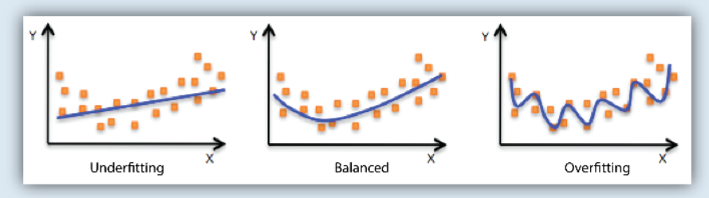

# Generalisierung und Overfitting

Wegen der Wichtigkeit der Begriffe erläutern wir sie in diesem eigenständigen Kapitel.

**Generalisierung** 

- bedeutet,  dass ein Modell vergleichsweise gut auf Daten funktioniert, die es noch nie vorher gesehen hat, (insbesondere nicht in der Trainingsphase).   Derartige Daten nennen wir *unbekannte Daten* oder *never-before-seen-data*.
- ist ein erwünschte Eigenschaft eines Modells, da wir ja im supervised learning insbesondere an der Vorhersagefähigkeit für unbekannte Daten interessiert sind. 

Kurz in in englischer Sprache: *Generalization is a term used to describe a model’s ability to react to new data.*^[https://wp.wwu.edu/machinelearning/2017/01/22/generalization-and-overfitting/]

**Overfitting**

- bedeutet, dass das Modell optimal an die Trainingsdaten angepasst wird, aber im Gegenzug die Generalisierungs-Eigenschaft verliert (maschinelles Auswendiglernen)
- entsteht durch zu komplexe Modelle und
- ist eine unerwünschte Eigenschaft

**Underfitting**

- bedeutet, dass das Modell nicht ausreichend an die Trainingsdaten angepasst wird, und im Gegenzug eine verbesserungsfähige Generalisierungs-Eigenschaft aufweist (zu wenig gelernt...)
- entsteht durch zu einfache Modelle und
- ist eine unerwünschte Eigenschaft.

{width=100%}

