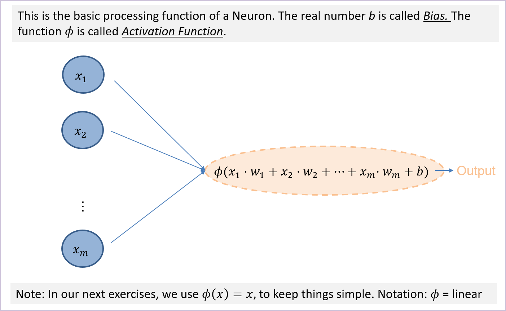
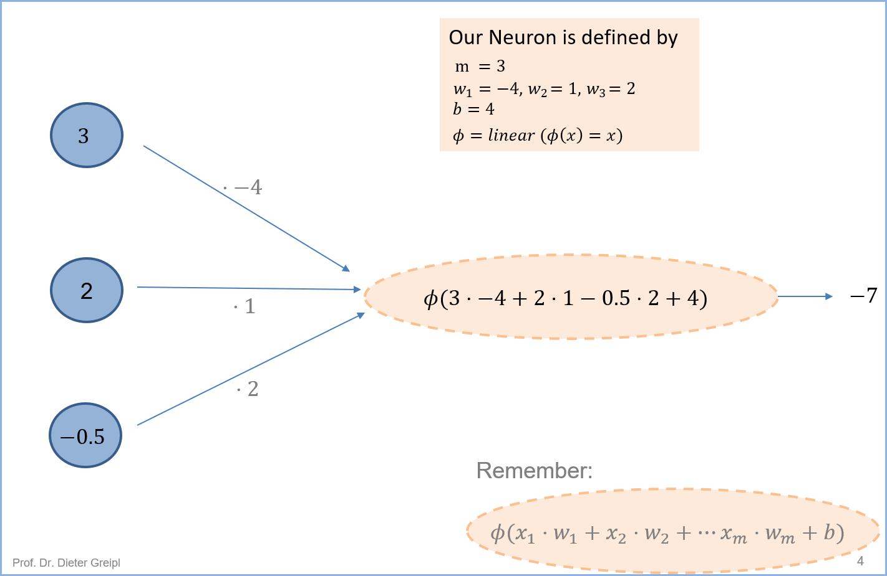
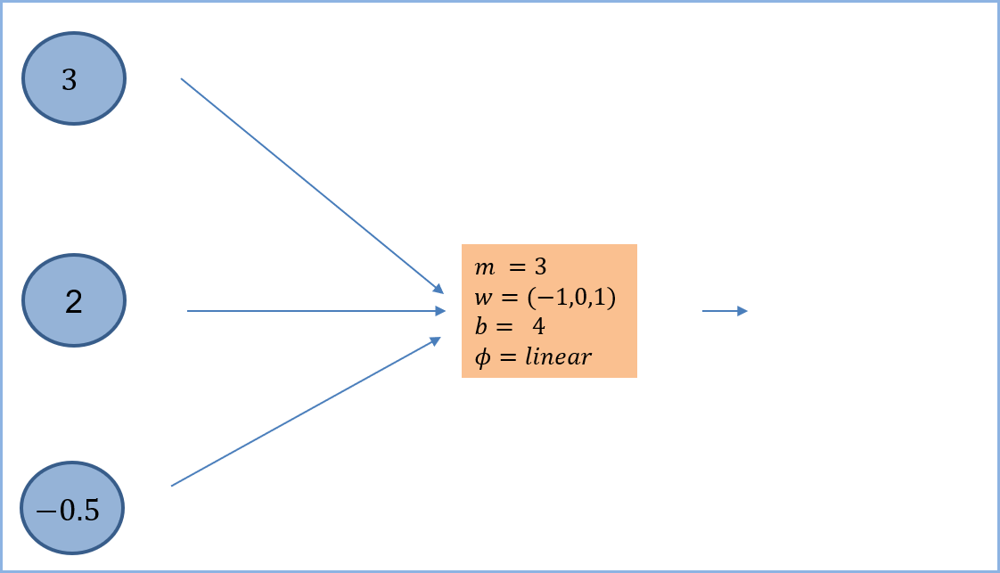
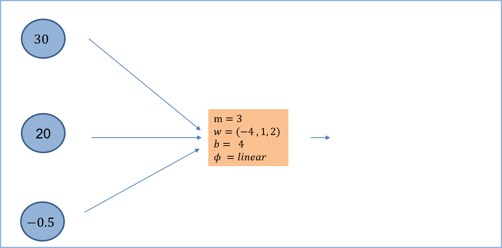
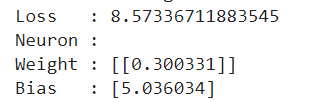
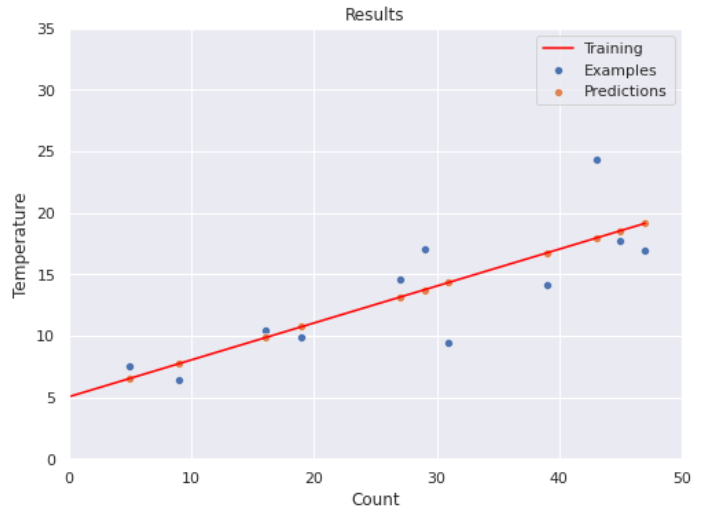
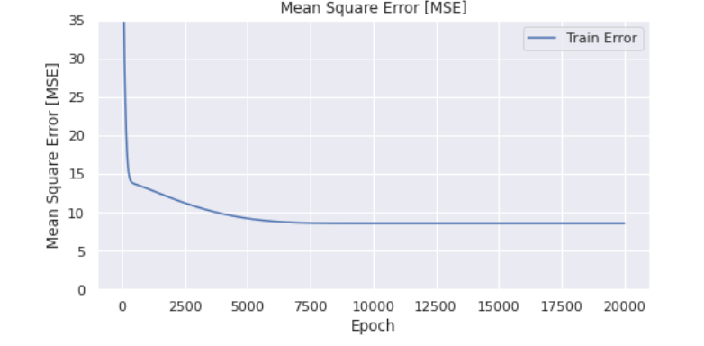
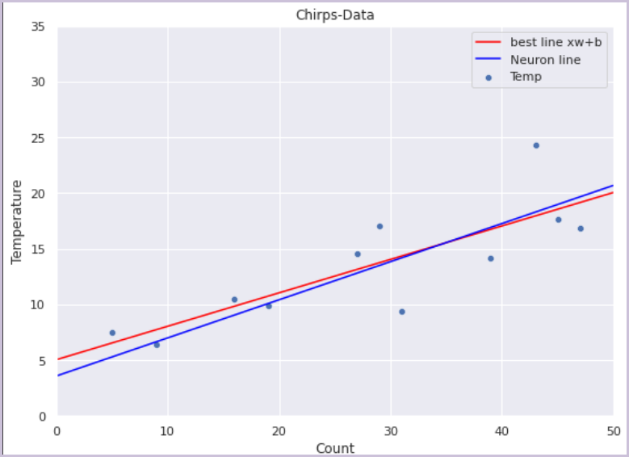

# Neuronale Netze

## Neuron (Perceptron)

Ein Neuron (auch Perzeptron genannt) ist der Grundbaustein neuronaler Netzwerke. Ein Neuron hat folgende Grundeigenschaften

* die Eingabe eines Neurons ist ein Vektor $x \in \mathbb{R}^m$ .
* die Ausgabe eines Neurons ist eine reelle Zahl und wird auch **Activation **genannt.

Ein Neuron entspricht damit einer Funktion, die von $\mathbb{R}^m$ nach $\mathbb{R}$ abbildet.

 

.png){width=100%}


### Gewichtsvektor und Bias

Wir geben nun dieser Funktion eine Struktur. Sie wird wie folgt funktionieren:


{width=100%}

Auf die Aktivierungsfunktion gehen wir erst in Abschnitt \@ref(id-activation) ein. In der Klammer von $\phi$ erkennen sie ein Skalarprodukt!


#### Skalarprodukt mit Python (Skalarprodukt){-}

```python
import numpy as np
u = np.array( [1, 2, -1] )
v = np.array( [0, 1, 3] )
print(  np.dot(u,v) )
```


### Notation

In Vektorschreibweise berechnet ein Neuron also
$$
\phi( \mathbf{x} \cdot \mathbf{w} + b), \quad\text{mit} \quad x,w \in \mathbb{R}^m, b \in \mathbb{R}
$$

Wir werden für $\phi$ meist recht einfache Funktionen werden, z.B. wie in obiger Folie erläutert  $\phi(x) = x$. Die Vektor  $w$ heißt **Gewichtsvektor **(_weight vector_ oder kurz _weight)_, die Zahl $b$ heißt **Bias. **Häufig wird der Bias ebenfalls als weight betrachtet. Dann sprechen wir _nur_ von Weights. Wir wollen das aber in diesem Modul vermeiden, wenn es geht.

> **Ein Neuron ist also von m+1 Werten (Parametern) abhängig, mit denen man das Verhalten des Neurons einstellen kann.**


### Beispiel

Nachfolgendes Beispiel erläutert die Rechnung eines Neurons per Hand:

{width=100%}


### Neuron mit Python

Mit folgenden Zeilen vollziehen können sie die Rechnung on obiger Folie nachvollziehen.

```python
import numpy as np
# x is a row vector with shape (1,3)
x = np.array([3,2,-0.5])
print( x.shape)

# w is a col vector with shape (3,1)
w = np.array([-4,1,2])
print( w.shape)

# Bias or Interception
b=4
activation = np.dot(x,w) + b 

print( activation )
print( activation.shape)
```


### Übungen

#### Übung 1{-}

Berechnen Sie die Ausgabe des folgenden Neurons:

{width=100%}


#### Übung 2{-}

Berechnen Sie die Ausgabe des folgenden Neurons:

{width=100%}


### Neuron mit Keras

Nachfolgendes Programmstück definiert ein Neuronales Netz, bereits in Form eines Models, wie für Maschinelles Lernen benötigt. Wir trainieren das Modell noch nicht, sondern setzten die Gewichte manuell. Der Trainingsprozess würde die Gewichte so setzen, dass die *Activations*  für jeden Input möglichst nahe an den Labels wären.

```python
%tensorflow_version 2.x
from tensorflow.keras.models import Sequential
from tensorflow.keras.layers import Dense, Activation
import numpy as np;

# Activations: linear, relu, sigmoid, tanh, 
# Baue neuronales Netz mit
#  - einem Neuron
#  - drei Eingängen
#  - einer linearen Activation-Function phi
layer_0 = Dense(1, input_dim=3, activation='linear')
model = Sequential() # klären wir später
model.add( layer_0 ) # klären wir später

# Setze Gewichte und Bias des einen Neurons
my_kernel = np.array([ [-4], [1], [2] ] )
my_bias = np.array( [4] ); 
model.layers[0].set_weights( [ my_kernel, my_bias ] )

# now feed two feature vectors into the model
X = np.array([
              [3,2,-0.5],
              [30,20,-0.5]
              ])

# Calculate the activation of the neuron
y = model.predict( X );
print( y );
```


## Beispiel: "Grillen" -  Neuronal

Wir kehren zurück zu unserem Regressionsbeispiel und lösen dieses mit dem einfachsten neuronalen Netz: es besteht nur aus einem Neuron.

### Das "Grillen-Neuron"

Wenn wir ein Neuron mit *einem* Eingabewert $(m=1)$ und *linearer Activation* bauen, so ist die Ausgabe des Neurons

$$
y = M_{w,b}(\mathbf{x}) = \mathbf{x} \cdot  \mathbf{w} + b
$$

Dies entspricht aber exakt unserem Modell im Fall der Regression! (siehe Abschnitt \@ref(id-modellfamilie) )


### Neuronales Netz und Learning

Folgender Code erzeugt die Modellfamilie und berechnet dann das optimale Modell:

```python
from tensorflow.keras.models import Sequential
from tensorflow.keras.layers import Dense, Activation
from tensorflow.keras import optimizers
from keras.utils.vis_utils import plot_model
import pandas as pd

# Acvtivations: linear, relu, sigmoid, tanh, 
model = Sequential()
model.add( Dense(1, activation='linear') )
model.compile(loss='mean_squared_error', optimizer='adam')

# Run the training
history = model.fit(X,y, verbose=0, epochs= 20000)

# We display the weighst and biases
print(f'Loss   : {history.history["loss"][-1]}')

print("Neuron :")
[weight, bias] = model.layers[0].get_weights();
print(f'Weight : {weight}')
print(f'Bias   : {bias}')
```

(Mögliche) Ausgabe: 

{width=50%}


###  Visualisierung des gelernten Modells

Folgende Grafik visualisiert das Geschehen bisher:

* Die blauen Punkte zeigen die _labelled examples_
* Die orangen Punkte zeigen die _predictions _für die features
* Die rote Linie visualisiert das Modell, als Ergebnis des Trainings 




### Trainingsschritt und Epochen

Ein **Trainingsschritt **(learning-step) ist eine neue Festlegung der Parameter eines Modells, so dass der Loss kleiner wird. Diese neue Festlegung funktioniert auf der Basis des Gradienten der Loss-Funktion. In obigem Beispiel wäre der Trainingsschritt $h_0.$ Eine **Epoche **ist ein Trainingsschritt auf der Grundlage aller Trainingsdaten. Wir identifizieren für den Moment eine Epoche mit einem Abstiegsschritt.


### Visualisierung des Lernfortschritts

{width=100%}


### Python: Anzeige der Lernkurve

```python
import seaborn as sns

# Lernfortverhalten visualisieren
fig,ax = plt.subplots( figsize=(8,4) )
ax.set_title("Lernverlauf (MSE)")
ax.set_xlabel("Epochen")
ax.set_ylabel("MSE (Loss)")
ax.set_ylim(0,40)
sns.lineplot( x = history.epoch, y = history.history["loss"], label = "Train. Loss")
```


### Lösungen im Vergleich

{width=100%}


### Python: Anzeige der Lösungen

```python
from matplotlib import pyplot as plt
import seaborn as sns
import pandas as pd
import numpy as np

chirps = pd.DataFrame({
    "Count": [31,16,29,43,27,19,47,9,45,5,39],
    "Temp": [9.4,10.5,17.1,24.3,14.6,9.9,16.9,6.4,17.7,7.5,14.2]    
})

X = chirps["Count"].to_numpy().reshape(11,-1)
y = chirps["Temp"].to_numpy().reshape(11,-1)
print(y)

x_values = np.array([0, 50])
print(bias.shape)
print(weight.shape)

y_netz = np.array([bias, 50*weight[0] + bias]).flatten()
y_best = np.array([5.036035, 50*0.3003342 + 5.036035])

fig,ax = plt.subplots(figsize=(9, 9))
ax.set_aspect('equal')
ax.set_title("Chirps-Data") 
ax.set_xlabel("Count")
ax.set_ylabel("Temperature")

ax.set_xlim(0, 50)
ax.set_ylim(0, 35)

sns.set()
sns.scatterplot(data = chirps, x = "Count", y="Temp", label="Temp")

sns.lineplot(x=x_values,y= y_best, color="red", label="best line xw+b")
sns.lineplot(x=x_values,y= y_netz, color="blue", label="Neuron line")

```
## Strukturen Neuronaler Netze (Layer)

### Netzwerk-Layer (Input-, Output-Layer)

Wir wollen nun mehrere Neuronen zu einem Netz verschalten und brauchen dazu eine strukturierte Anordnung der Neuronen. Nachfolgende Grafik zeigt das rechte einfache Konzept eines Layers, in dem wir  drei Neuronen in einer Schicht aufbauen. 

Wichtig:

.png>){width=100%}

1. Man bezeichnet die Schicht der Eingabewerte, also der Features, auch als **Input Layer**
2. Dier erste Schicht von Neuronen wird als Layer 0 bezeichnet.
3. Jeder Wert aus dem Input-Layer wird mit jedem Werte aus dem Layer 0 verbunden. 
4. Das obige Netz gibt drei Werte aus. Die letzte Schicht, die Werte ausgibt, heißt auch **Output-Layer**.

> Eine Struktur von Neuronen, die einen Feature-Vektor verarbeitet heißt **Neuronales Netz.**

###  Multi Layer Stuktur

Natürlich können wir nun mehrere Schicht (Layer) anordnen und miteinander verbinden. Folgende Abbildung zeigt eine derartige Struktur

.png>){width=100%}

Wichtig:

1. Ein Layer, der nicht Output-Layer ist, heißt "**Hidden Layer**".

### Übung 1{#id-ue1}

Lösen Sie für diese Neuronale Netz nachfolgende Aufgaben:

.png>){width=100%}

a)  Berechnen Sie den Output des folgenden Netzes für x= (1,3,5) und x = (0,1,0).

b) Berechnen Sie das Netz für für x = (1,3,5) erneut. Nehmen sie nun aber statt `linear` stets `relu `als Aktivierung an.

### Eigenschaften Neuronaler Netze

#### Fully Connected Layer

Ein Layer heißt **Fully Connected Layer **oder auch **Dense Layer,** wenn jedes Neuron in dem Layer mit **allen **Neuronen aus dem vorhergehenden Layer verbunden ist. Der Layer 0 heißt fully connected, wenn jedes Neuron mit jedem Eingabewert verbunden ist. 

> Wir betrachten in diesem Kurs nur Fully Connected Layers

#### Feed-Forward Netze

In den Neuronale Netzen, die wir in diesem Kurs betrachten, fließen die Feature-Werte von links nach rechts durch das Netz, werden dabei sukzessive in den Ebenen verarbeitet und führen dann zu einer Ausgabe. Wir sehen insbesondere keine Rücksprünge vor. Derartige Netze heißen **Feed-Forward-Netze**

Nun verstehen wir auch den Befehl zur Konstruktion des Netzes für den Chirps-Case:

```python
%tensorflow_version 2.x
from tensorflow.keras.models import Sequential
from tensorflow.keras.layers import Dense, Activation
from tensorflow.keras import optimizers

model = Sequential()
model.add( Dense(1, activation='linear') )
```

Zeile 1 besagt, dass wir ein feed-forward Modell aufbauen und in Zeile 2 wird der erste Layer (ganz korrekt: Layer 0) hinzugefügt. Es handelt sich dabei um einen Dense Layer mit  einem Neuron und einer linearen Aktivierung.

#### Dense Feed-Forward Netze in Python

Nachfolgender Befehlt konstruiert das Netz aus Übung 1. Beachten Sie dass dabei die Gewicht noch nicht explizit gesetzt werden.

```python
%tensorflow_version 2.x
from tensorflow.keras.models import Sequential
from tensorflow.keras.layers import Dense, Activation
from tensorflow.keras import optimizers

model = Sequential()
model.add( Dense(2, activation='linear') )
model.add( Dense(1, activation='linear') )
```


### Dense Layers in Matrix-Schreibweise

In wenn sich in einem Dense Layer $z$ Neuronen befinden, und jedes dieser Neuronen mit m Eingabewerten versorgt wird,  

* $z$ Gewichtsvektoren (Spaltenvektoren) jeweils der Dimension m, die wir zu einer Gewichtsmatrix $W \in \mathbb{R}^{m \times z}$ 
* $z$ Biaswerte, die wir zu einem Bias-Vektor $\bf{b} \in \mathbb{R}^z$** **zusammenfassen (Zeilenvektor)**.** 

Dann lässt sich die Operation eines Layers schreiben als:

$$
\phi(x\cdot W+b)
$$

Achtung: Der Wert in der Klammer ist ein Zeilenvektor! Nachfolgendes Bild verdeutlicht, was in dem Funktionsargument passiert:

.png>){width=100%}


Dabei ist wieder um $\phi$ eine Aktivierungsfunktion, die aber nun auf einen Vektor angewendet wird.  Für die Aktivierungsfunktionen `linear`, `relu`, und `sigmoid `wenden wir diese Funktion einfach auf die einzelnen Einträge an, also  

$$
\phi(\mathbf{v}) = 
\phi(v_1,v_2, ..,v_n )
=
(\phi(v_1),\phi(v_1), ..,\phi(v_1) )
$$

Hinweis: Das ist formal nicht ganz korrekt, aber wir leisten uns die Unschärfe. Sehen sie das (formale) Problem?

### Übung 2

Geben sie für die beiden Layer aus Übung 1  in Abschnitt (\@ref{#id-ueb1})  jeweils Gewichtsmatrix und Bias-Vektor an.

## Aktivierungsfunktionen{#id-activation}

Unser Perzeptron ist für $\phi(x) = x$ bisher eine lineares Modell. Lineare Modell haben ihre Grenzen beim Lösen komplexerer Aufgabenstellungen. Wir verwenden daher in der Praxis nicht-lineare, aber immer noch einfache Aktivierungsfunktionen.

### Rectified Linear Unit \(ReLU\)

ReLU modifiziert nur den negative Teil der Identitätsfunktion und setzt den negativen Teil auf Null, daher auch die Bezeichnung "rectifier = Gleichrichter".

$$
\phi(x) = \left\{
\begin{array}{ll}
x &,\text{falls} \geq 0 \\
0 & \, \textrm{sonst} \\
\end{array}
\right.
$$

 Der Graph von ReLU ist recht einfach:

.png>){width=100%}

Die Befehle zum Zeichnen dieses Graphen finden Sie hier. 

Die ReLu Aktivierung erlaubt ein Einstellung eines Neurons so, dass es nur dann eine positive Ausgabe liefert, wenn der Ausgabewert positiv ist. Damit gewinnt der Parameter  $b$ eine anschauliche Bedeutung. Das Neuron liefert nur dann ein \(stets positives\) Ergebnis wenn die Gewichtung der Eingabewert größer als $-b$ ist.

### Sigmoid

Die Sigmoid-Aktivierung dient dazu, die Ausgaben eines Neurons in das Intervall von 0 bis 1 zu pressen. Die Definition ist etwas komplizierter:

$$
\phi(x) = \frac{1}{1+e^{-x}}
$$

Wie sie leicht sehen, strebt die Sigmoid-Funktion für sehr große Werte von x gegen Eins und für sehr stark negative Werte von x gegen Null. Hier der Funktionsgraph:

.png>){width=100%}

