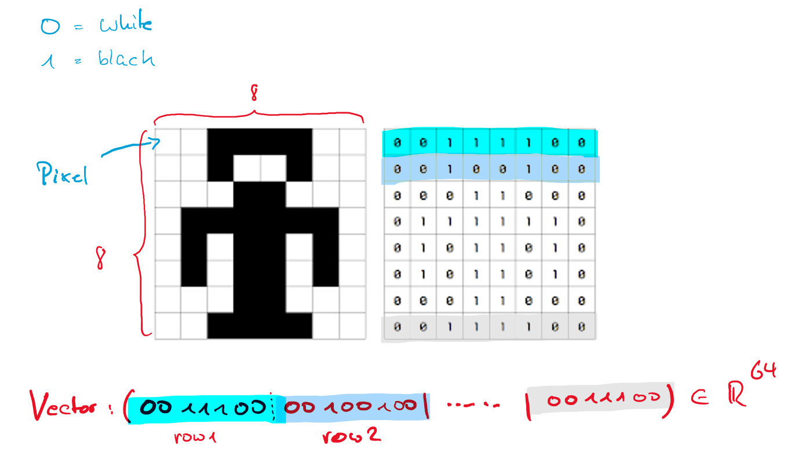
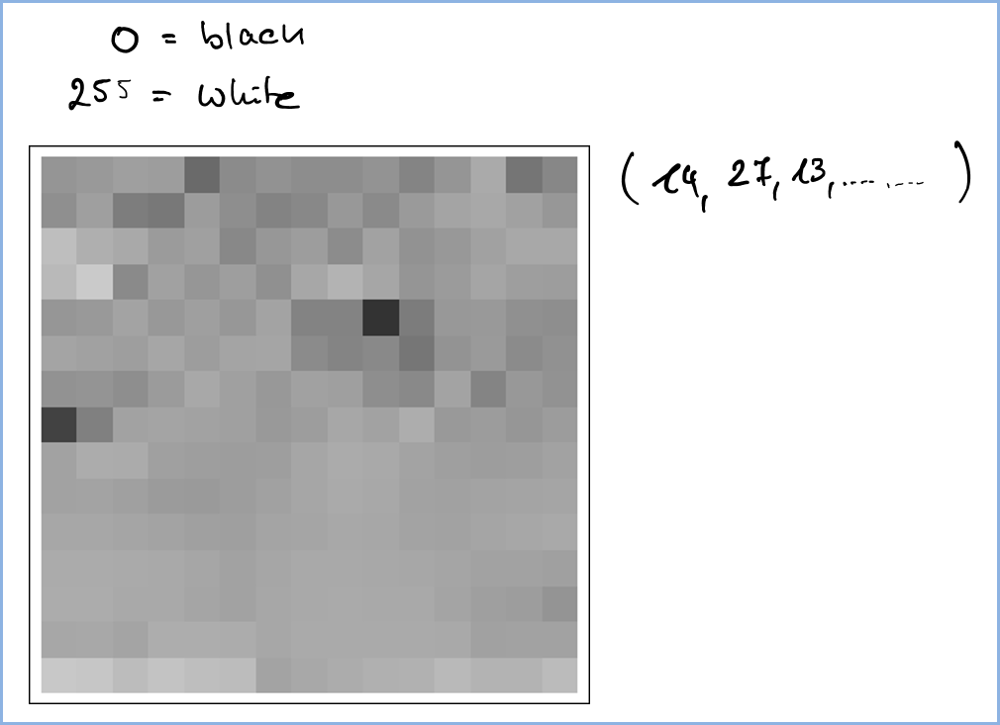
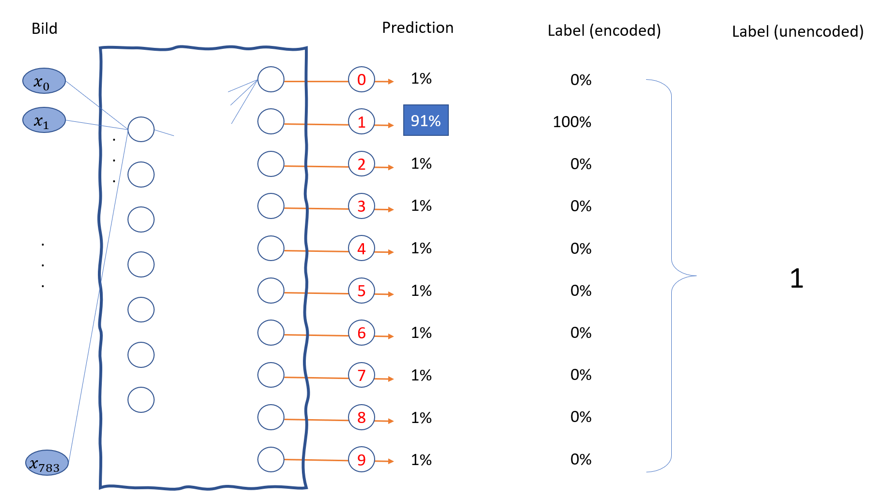

# Case Study MNIST

MNIST (Modified National Institute of Standards and Technology database) ist eine Datenbank mit Bildern handgeschriebener Ziffern.  Weiteres finden sie bei https://en.wikipedia.org/wiki/MNIST_database oder https://medium.com/tebs-lab/how-to-classify-mnist-digits-with-different-neural-network-architectures-39c75a0f03e3 


## Exemplarische Bilder

MNIST (Modified National Institute of Standards and Technology database) ist eine Datenbank mit Bildern handgeschriebener Ziffern. Nach folgende Abbildung zeigt ein Beispiel.

.png>){width=70%}

Nicht alle Bilder sind  so klar zu identifizieren, wie obiges Bild. Welch Ziffer zeigt Ihrer Meinung nach folgendes Bild:

 (1).png>){width=70%}

oder folgendes:

.png>){width=70%}

Zur MNIST Datenbank:

1. Sie besteht aus 60.000 Trainingsbildern und 10.000 Testbildern mit den labels, also der dargestellten Ziffer.
2. Jedes Bild besteht aus 28x28, also insgesamt  784 Pixeln. Der Grauwert jedes  Pixels ist mit einer Zahl zwischen 0 (weiß) und 255 (schwarz) kodiert. 
3. Die Repräsentation eines Bilds ist ein Array mit Shape (28,28) 

## Einschub: Bilder als Vektoren

Bilder sind als Vektoren darstellbar, wenn man die Pixelwerte in eine Reihenfolge bringt und so einen Vektor erzeugt.


{width=100%}

Analog kann man für Grauwertbilder vorgehen:

{width=100%}

## Data Load

```python
from tensorflow import keras
import matplotlib.pyplot as plt
import numpy as np

# Load a toy dataset for the sake of this example
(X_train, y_train), (X_test, y_test) = keras.datasets.mnist.load_data()
print( f'X_train : {X_train.shape}')
print( f'y_train : {y_train.shape}')

print( f'X_test  : {X_test.shape}')
print( f'y_test  : {y_test.shape}')
```


## Inspect Labelled Example

```python
bild_nummer = 2
bild = X_train[bild_nummer]
label = y_train[bild_nummer]
print( f"Shape               : {bild.shape}")
print( f"Minimaler Wert      : {bild.min()}")
print( f"Durchschnittl. Wert : {bild.mean()}")
print( f"Maximaler Wert      : {bild.max()}")
print( f"Label               : {label}")

plt.imshow( bild, cmap= plt.get_cmap('Greys') )
plt.figure()
```


## Konzept unseres Netzes

Nach folgende Abbildung zeigt die Struktur unseres Netzes

* Das Bild fließt als Vektor der Dimension 784=28*28 in des neuronale Netz 

* Unser Netz hat 10 Ausgänge, wobei

  * jedem Ausgang eine Ziffer zugeordnet ist und
  * die Activation eines Ausgangs der Wahrscheinlichkeit entspricht, dass das eingebene Bild der zugeordneten Ziffer entspricht.

* Damit das Netz funktioniert, müssen wir die labels in einen 10-dimensionalen Vektor transformieren. Hierzu verwenden wir one-hot-encoding).

  

{width=100%}


Nun bereiten wir unsere Trainings- und Testdaten vor.


## Preprocessing

In diesem Abschnitt bereiten wir die Daten für die Nutzung in einem Lernalgorithmus vor.

### Reshaping und Skalierung der Bilder

Wir wandeln jedes Bild in einen Vektoren der Dimension 784 um. Dabei skalieren wir die Grauwerte in der Bereich von 0 bis 1. 

```python
X_train = X_train.reshape(60000, 784).astype('float32') / 255
X_test = X_test.reshape(10000, 784).astype('float32') / 255

print( f'X_train       : {X_train.shape}')
print( f'X_test        : {X_test.shape}')
print( f'Bild 0 (shape): {X_test[0].shape}')
print( f'Bild 0 (min)  : {X_test[0].min()}')
print( f'Bild 0 (max)  : {X_test[0].max()}')

```

Ergebnis: 

-164062684512912.png>){width=50%}


### One-Hot-Encoding  der Labels

Für die MNIST Labels, also die Ziffern von 0 bis 9, zeigt folgende Abbildung das One-Hot-Encoding der Labels:

-164062667226310.png>){width=100%}


Dazu brauchen wir folgenden Code:

```python
from sklearn.preprocessing import OneHotEncoder

ziffern = [[0], [1],[2],[3],[4],[5],[6],[7],[8],[9]]
enc = OneHotEncoder(sparse=False)
enc.fit(ziffern)

y_train_help = y_train.reshape( (y_train.size,1))
y_test_help  = y_test.reshape( (y_test.size,1))
print("Reshape: ")
print(f"Shape von y_train      :{y_train.shape} ")
print(f"Shape von y_train_help :{y_train_help.shape} \n")

# One-Hot-Labels erzeugen
y_train_one_hot = enc.transform( y_train_help )
y_test_one_hot =  enc.transform( y_test_help )

print(f"Shape von y_train_one_hot :{y_train_one_hot.shape} ")
print(f"Shape von y_test_one_hot  :{y_test_one_hot.shape} \n")

# Test
print("Label :", y_train[0], ", Label One Hot :", y_train_one_hot[0], ' (1 at position ', y_train_one_hot[0].argmax(), ")" )
print("Label :", y_train[1], ", Label One Hot :", y_train_one_hot[1], ' (1 at position ', y_train_one_hot[1].argmax(), ")" )
print("Label :", y_train[2], ", Label One Hot :", y_train_one_hot[2], ' (1 at position ', y_train_one_hot[2].argmax(), ")" )

```

Ausgabe:

-164062688356913.png>){width=100%}


> Die Labels für unser Netz sind also `y_train_one_hot` und`y_test_one_hot`

### Aufteilung in Training-Data und Validation-Data

Sie erinnern sich an den Begriff der Validation-Data, den wir in dem [diese Begriffe einführenden Abschnitt ](https://the-technology-lab.gitbook.io/bw-610-dsml/analytics-und-datascience/5-maschinelles-lernen/entscheidugsbaeume#aufteilung-in-training-set-und-test-set)nicht erläutert haben. Sie erinnern sich, dass wir die Test-Daten nicht in den Lernprozess einbeziehen wollten, um unser Modell nicht zu sehr auf den vorliegenden Datensatz anzupassen (siehe [hier](https://the-technology-lab.gitbook.io/bw-610-dsml/analytics-und-datascience/5-maschinelles-lernen/generalisierung-und-overfitting)). Da wir aber auch während des Entwicklungsprozesses unseres Modell eine Kontrollen über die Fähigkeit zur Generalisierung habe wollen, zweigen wir von den Trainingsdaten nochmals einen Teil der Daten für diese Bewertung ab.

Nachfolgendes Bild illustriert den Sachverhalt:

-164062718205317.png>){width=100%}

Hierzu verwenden wir nachfolgenden Code:

```python
#Define first 50k as train-split
X_train_split = X_train[:-10000]
y_train_split = y_train_one_hot[:-10000]

#Define last 10k as train-split
X_val_split = X_train[-10000:]
y_val_split = y_train_one_hot[-10000:]

#No action, just to keep logic in naming 
X_test_split = X_test
y_test_split = y_test_one_hot

print("Training Data    X_train_split.shape :", X_train_split.shape)
print("                 y_train_split.shape :", y_train_split.shape)
print("\n")
print("Validation Data  X_val_split.shape   :", X_val_split.shape)
print("                 y_val_split.shape   :", y_val_split.shape)
print("\n")
print("Test Data        X_test_split.shape   :", X_test_split.shape)
print("                 y_test_split.shape   :", y_test_split.shape)
```

 Ausgabe:

.png>){width=70%}

Damit ist unsere Datenvorbereitung zu Ende. Im letzten Teil dieses Abschnitts finden Sie noch den gesamten Code zur Datenvorbereitung am Stück.


### Gesamter Code zum Preprocessing

```python
from tensorflow import keras
import matplotlib.pyplot as plt
import numpy as np
from sklearn.preprocessing import OneHotEncoder

# Load data (already split in training and test set)--
(X_train, y_train), (X_test, y_test) = keras.datasets.mnist.load_data()

# Reshape and scale features-------------------------- 
X_train = X_train.reshape(60000, 784).astype('float32') / 255
X_test = X_test.reshape(10000, 784).astype('float32') / 255

# One-hot-encoding of labels---------------------------
ziffern = [[0], [1],[2],[3],[4],[5],[6],[7],[8],[9]]
enc = OneHotEncoder(sparse=False)
enc.fit(ziffern)

# Ein 2D-Array erzeugen
y_train_help = y_train.reshape( (y_train.size,1))
y_test_help  = y_test.reshape( (y_test.size,1))

# One-Hot-Labels erzeugen
y_train_one_hot = enc.transform( y_train_help )
y_test_one_hot =  enc.transform( y_test_help )

# Spitting training data ------------------------------
#Define first 50k as train-split
X_train_split = X_train[:-10000]
y_train_split = y_train_one_hot[:-10000]

#Define last 10k as train-split
X_val_split = X_train[-10000:]
y_val_split = y_train_one_hot[-10000:]

#No action, just to keep logic in naming 
X_test_split = X_test
y_test_split = y_test_one_hot

print("Training Data    X_train_split.shape :", X_train_split.shape)
print("                 y_test_split.shape  :", y_test_split.shape)
print("\n")
print("Validation Data  X_val_split.shape   :", X_val_split.shape)
print("                 y_val_split.shape   :", y_val_split.shape)
print("\n")
print("Test Data        X_test_split.shape   :", X_test_split.shape)
print("                 y_test_split.shape   :", y_test_split.shape)
```


## Modellfamilie und Training


### Neuronales Netz

Folgender Code definiert das neuronale Netz, trainiert es und gibt die Genauigkeiten (accuracy) auf den Test- und Validierungsdaten aus.  In dem Netz gibt es folgenden neue Elemente, die wir aber im Anschluss behandeln:

* Activation `softmax`
* Batches und `batch_size`
* Loss  `categorical_crossentropy`

```python
%tensorflow_version 2.x
from tensorflow.keras.models import Sequential
from tensorflow.keras.layers import Dense, Activation
from tensorflow.keras import optimizers
import matplotlib.pyplot as plt

from tensorflow import keras
from tensorflow.keras import layers

#https://www.tensorflow.org/guide/keras/train_and_evaluate 
model = Sequential()
model.add(Dense(64, input_dim=784, activation='relu')) 
model.add(Dense(64,  activation='relu')) 
model.add(Dense(10, activation='softmax')) # Output

model.compile(loss='categorical_crossentropy',
              metrics=['accuracy'])


print('# Fit model on training data')
result = model.fit(X_train_split, y_train_split,
                    batch_size=64,
                    epochs=20,
                    validation_data=(X_val_split, y_val_split))


import seaborn as sns
# Lernfortverhalten visualisieren
sns.set()
fig,ax = plt.subplots( figsize=(8,4) )
ax.set_title("Lernverlauf Accuracy")
ax.set_xlabel("Epochen")
ax.set_ylabel("Accuracy")
ax.set_ylim(0.8,1)
sns.lineplot( x = result.epoch, y = result.history["accuracy"], label = "Train. Acc.")
sns.lineplot( x = result.epoch, y = result.history["val_accuracy"], label = "Val. Acc.")

print("Accuracy on training data   : ", result.history["accuracy"][-1])
print("Accuracy on validation data : ", result.history["val_accuracy"][-1])
```

Sie sollten folgende Ausgabe sehen (Achtung, die Werte sollten ähnlich sein, sie werden aber nicht identisch sein.)

.png){width=100%}

Wir sind natürlich auch an der Performance auf den Testdaten interessiert.


### Predictions verstehen

Nachfolgender Code gibt die Predictions und den Label für ein einzelnes Bild aus. Wir sehen, dass Modell recht überzeugt ist, dass es sich bei Bild 32 aus dem Test-Set um eine Drei handelt.

```python
bild_nr = 32
pred = model.predict( X_test[bild_nr:bild_nr+1] )

print("Korrekter Label     :", y_test[bild_nr])
print("\nErgebnis von Predict als Array:", pred)

print("\nErgebnis von Predict in schönerer Ausgabe:")
for i in np.arange(0,10):
  print(f"Wahrscheinlichkeit für 'Bild zeigt {i}' :  {pred[0,i]:5f}" )

plt.imshow( X_test[bild_nr].reshape(28,28), cmap= plt.get_cmap('Greys') )
plt.figure()
```

Ausgabe (ihre Zahlen werden abweichen):

-164062700522715.png>){width=100%}


### Test-Qualität und falsch klassifizierte Bilder 

Mit der Vorarbeit von oben können wir nun eine Liste der falsch klassifizierten Bilder aus dem Test-Set erzeugen und damit die Accuracy auf dem Test-Set berechnen.:

```python
pred = model.predict(X_test_split)
c = 0
N = len(X_test)
for i in np.arange(0, len(X_test_split)):
  number_true = np.argmax( y_test_split[i] )
  number_pred = np.argmax(pred[i])
  confidence  = pred[i].max()
  if (number_pred != number_true):
    print(f"Bild {i} : Label: {number_true}, Prediction: {number_pred}")
    c = c + 1 
print( f"Fehlerhaft klassifiziert :",c)
print (f"Accuracy auf Test-Set    : {((N-c)/N)}")
```

Ausgabe:

-164062728276518.png>){width=100%}


Übrigens lässt sich die Test-Set Accuracy auch einfacher ermitteln:

```python
print("Evaluate on test data")
results = model.evaluate(X_test_split, y_test_split)
print("test loss, test acc:", results)
```

Ausgabe:

 -164062705394216.png>){width=100%}


### Spannende Fehler

Die obige Ausgabe der fehlerhaft klassifizierten Bilder hat 267 Ausgaben gezeigt. Das ist noch recht viel, um "spannende Fehler" herauszusuchen. Folgendes Programm erlaubt die Eingrenzung der Suche über die Wahrscheinlichkeit, mit der das Netz das Ergebnis festgelegt hat. Es unterscheiden sich nur die Zeilen 8 und 9:

```python
pred = model.predict(X_test)
c = 0
N = len(X_test)
for i in np.arange(0, len(X_test)):
  number_true = np.argmax( y_test_split[i] )
  number_pred = np.argmax(pred[i])
  confidence  = pred[i].max()
  if ((number_pred != number_true) & (confidence > 0.999)):
    print(f"Bild {i} : Label: {number_true}, Prediction: {number_pred}, Confidence : {confidence}")
    c = c + 1 
print( f"Fehlerhaft klassifiziert :",c)
print (f"Accuracy auf Test-Set    : {((N-c)/N)}")
```

 

### Mit voller Überzeugung daneben...

Durch die Änderung in Zeile 8 erhalten wir alle Ergebnisse, bei denen das Netz mit voller Überzeugung daneben liegt. (Mögliche) Ausgabe: 

-16406261991943.png>){width=100%}


Wir schauen uns nun ein falsch klassifiziertes Bild an, z.B. Bild 247. Hier wurde statt der korrekten 4 eine 2 vorhergesagt. Die Ausgabe aus obigem "Inspektionsprogramm" ergibt:

-16406262247284.png>){width=100%}


Unser Netz ist also recht überzeugt davon, dass es sich um eine 2 handelt, die korrekte Antwort 4 bekommt nur eine Wahrscheinlichkeit von 0.00026 Prozent. Mit voller Überzeugung daneben...

> Sie sehen, wie schwierig die Interpretation von Ausgaben ist. Selbst ein Ergebnis mit einer Wahrscheinlichkeit von 99.9 Prozent kann in unserem Netz falsch sein!


### Schwierig oder einfach?

Wenn wir das Auswertungsprogramm so  ändern, dass die Confidence z.B. unter 50 Prozent liegt, so erhalten wir offenbar Examples, deren Klassifikation dem Netzwerk schwer gefallen ist. 

Beispiele:

-16406262515555.png>){width=100%}


Das Bild 1709 zeigt diese Problematik. Mit hoher Unentschlossenheit wird zwischen der korrekten 9 und der falschen 5 die falsche Entscheidung getroffen. Wäre Ihnen dieser Fehler auch unterlaufen? 


-16406262734586.png>){width=100%}


### Ziffernbasierte Trefferquoten

Abschließend untersuchen wir noch, welche Ziffer besonders häufig falsch  klassifiziert wurde. Am meisten Probleme hatte "mein" Netz mit Ziffer 8.

-16406263077247.png>){width=100%}


Folgender Code wurde verwendet:

```python
pred = model.predict(X_test_split)
result_vector = np.zeros(20).reshape(10,2);
for i in np.arange(0, len(X_test)):
  number_true = np.argmax( y_test_split[i] )
  number_pred = np.argmax(pred[i])
  
  # Zähle die korrekte Klassifikation
  if (number_pred == number_true):
    result_vector[number_true, 0]  = result_vector[number_true, 0] + 1
  else:
    result_vector[number_true, 1]  = result_vector[number_true, 1] + 1 
    
print(f'{result_vector[:,1].sum()} Fehler in Testbildern,')
for i in np.arange(0,10):
  print(f'Ziffer {i} : Korrekt: {result_vector[i,0]} \tFehler : {result_vector[i,1]} \tProzent {100*result_vector[i,0]/(result_vector[i,0] + result_vector[i,1])}' )

```

Zuletzt schauen wir uns die Fehler noch genauer an: Welche falsche Ziffer  wurde statt der korrekten Ziffer gewählt, oder kurz gesagt: "Mit welcher Ziffer die Ziffern wie oft verwechselt?"

-16406263218878.png>){width=100%}


Der Code hierzu:

```python
pred = model.predict(X_test_split)
result_matrix = np.zeros(100).reshape(10,10);
for i in np.arange(0, len(X_test_split)):
  number_true = np.argmax( y_test_split[i] )
  number_pred = np.argmax(pred[i])
 
  result_matrix[number_true, number_pred]  = result_matrix[number_true, number_pred] + 1
    
import pandas as pd
result_matrix_as_df = pd.DataFrame(result_matrix,
                    columns=['0', '1', '2', '3' , '4' , '5' , '6' , '7' , '8' , '9'])

pd.set_option('display.max_rows', 10)
print( result_matrix_as_df )
```

In obiger Tabelle wird die 4 "häufig" mit der 9 fehl-klassifiziert (rote Markierung). Nachfolgender Code zeigt ihnen diese Ziffern an.

```python
pred = model.predict(X_test_split)
for i in np.arange(0, len(X_test_split)):
  number_true = np.argmax( y_test_split[i] )
  number_pred = np.argmax(pred[i])
  if (number_true == 4) & (number_pred == 9):    
    plt.figure()
    plt.imshow( X_test_split[i,:].reshape(28,28), cmap= plt.get_cmap('Greys') )
    plt.show()
```


## Softmax

Die Softmax-Aktivierung wird in der Regel bei Klassifizierungsaufgaben mit mehr als zwei Klassen im Output-Layer angewendet. Sie sorgt dafür, dass

* aller Ausgaben zwischen 0 und 1 liegen und
* die Summe aller Ausgaben gleich 1 ist.

Nachfolgende Abbildung erläutert das  mathematische Modell: 

-16406264561089.png>){width=100%}

