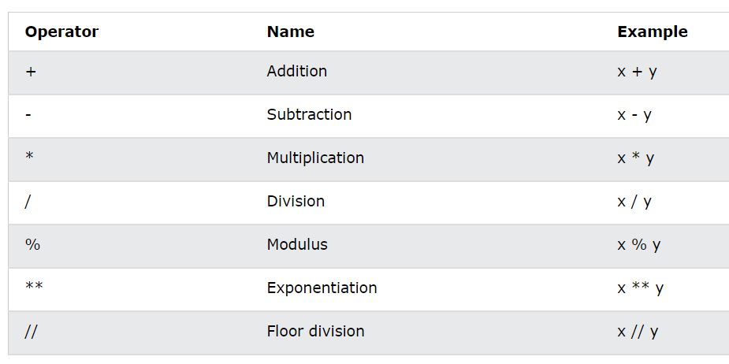

# Python - Quickstart

## Colab-Notebooks

## Hallo Welt

```python
print("Hallo Welt")
```

Ausgabe:

```
#> Hallo Welt
```

## Variablen

Variablen sind Platzhalter für Werte, wir sprechen vom _Wert einer Variable_.  Im nachfolgendem Beispiel wird der Variable mit dem Namen `x`in Zeile 1 der Wert 1 zugewiesen. Variablen haben immer einen Namen. Einen Wert erhalten sie erst  durch eine sog. Zuweisung (wie in Zeile 1). In Zeile 2 drucken wir den Wert aus. Führen Sie also folgende Phython-Befehle aus:


```python
x = 1
print(x)
```

> Die erstmalige Zuweisung eines Wertes an eine Variable heißt Initialisierung.


## Datentypen

### Datentyp "Zahlen"


#### Ganze Zahlen und rationale Zahlen

Zahlen sind recht einfach zu verstehen, wir haben ja oben schon einige Beispiele gesehen. Hier nochmal eine Zusammenfassung wichtiger Beispiele mit rationalen Zahlen:&#x20;

```python
a = 2
b = 1/3
c = 1.1
# Funktionen
d = a + b; print(d)
d = a - b; print(d)
d = a * b; print(d)
d = a / b; print(d)
```


### Datentyp "Strings"

Zeichenketten sind ebenfalls recht einfach zu verstehen. Führen Sie folgendes Beispiel aus:

```python
vorname = "Hans"
nachname = 'Huber'
name = vorname + ", " + nachname
print(name)
```

#### f-Strings

Statt eine zusammengesetzte Zeichenkette mit dem "+" - Operator auf zubauen, kann ein sogenannter f-String verwendet werden (siehe Zeile 3). f-Strings bringen für uns keine neue Funktion, machen aber die Verknüpfung von Strings einfacher.

```python
vorname = "Hans"
nachname = 'Huber'
name = f"{vorname}, {nachname}"
print(name)
```


### Datentyp "Boolean"

Es gibt in der Theorie unendlich viele Zahlen und Zeichenketten, aber nur zwei Wahrheitswerte: wahr oder falsch. In Phython: `True `und `False`

```python
z1 = False;
print (z1)
print( type(z1) );

z2 = 1 < 4;
print( z2 );
print( type(z2) );

print ("z1 and z2:", z1 and z2);
print ("z1 or z2:", z1 or z2);
```

## Operatoren

Die Bildschirmabzüge dieses Kapitels sind der Webseite [https://www.w3schools.com/python/python\_operators.asp](https://www.w3schools.com/python/python\_operators.asp) entnommen. Erarbeiten Sie sich die Operatoren selbst in kleinen Programmen, so wie wir das zu Zahlen bereits oben gemacht haben.


### Arithmetische Operatoren




### Vergleichsoperatoren

.png)


### Logische Operatoren

.png)


## Datentypen in der Übersicht

Nachfolgendes Programmstück beschreibt exemplarisch die nun bekannten Datentypen. Mit `type()` kann man sich den Datentyp einer Variable ausgeben lassen (oft hilfreich!)

```python
x = 1; 
print( f"1 : {type(x)}")

x = 1.1; 
print( f"1.1 : {type(x)}")

x = 4/2; 
print( f"4/2 : {type(x)}")

x = 'String'; 
print( f"'String' : {type(x)}")

x = [1,2,4]; 
print( f"[1,2,3] : {type(x)}")

x = (1,2);
print( f"(1,2) : {type(x)}")

x = 1 < -3
print( f"False : {type(x)}")
```


### Zusammenfassung 

| Eingebauter Datentyp | Kürzel     | Beispiele              |
| -------------------- | ---------- | ---------------------- |
| Text (Strings)       | str        | `x = "Haw-Landshut"`   |
| Zahlen (Numerisch)   | int, float | `x = 1` oder `x = 1.1` |
| Listen (Arrays)      | list       | `x = [1,2,3]`          |
| Tupel                | tuple      | `x = (1,2)`            |
| Wahrheitswerte       | bool       | `x = (1 < 3)`          |
