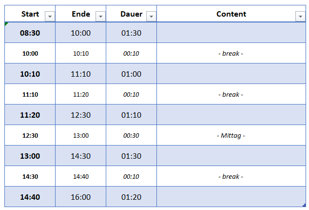
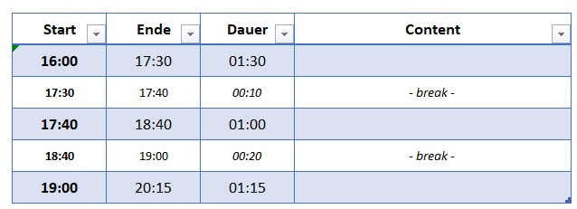
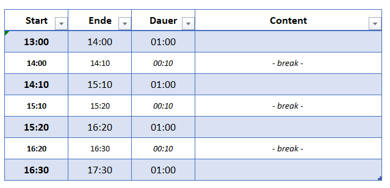
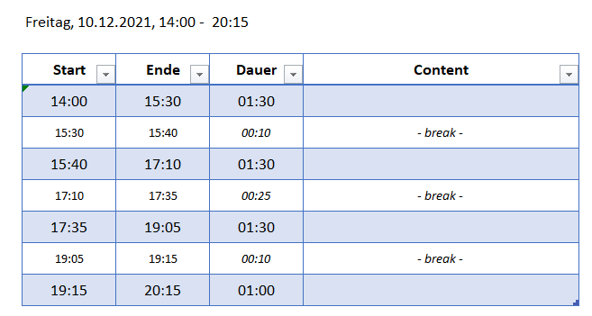

# Willkommen {-}

Dieses Skript entstand (und entsteht) aus meinen Lehrveranstaltungen rund um das Thema **Data Science & Machine Learning**. Die Inhalte richten sich an Studierende, die erste Schritte auf das KI -Spielfeld wagen und das Potential  von datengetriebenen Lösungsverfahren verstehen wollen.  

Insofern richtet sich die Darstellung an Studierende mit vertieftem Interesse an KI, die einen für Studierende angemessenes Vorwissen im Bereich Mathematik mitbringen.  Vorkenntnisse im Bereich der Programmierung sind nicht nötig, aber natürlich hilfreich.

Ich habe mich bemüht, zahlreiche Übungsbeispiele und Youtube-Videos einzubauen. Viele Themen lassen sich so besser darstellen. Sofern es Medien im Netz gibt, die die Sachverhalte gut darstellen, werde ich entsprechenden Links einbauen. Der Autor muss ja nicht der Meinung sein, alles besser zu können. Gleichwohl darf dadurch der rote Faden nicht verloren gehen. 

  

## Vorbereitungen	

Dieses Skript ist als Unterlage für zahlreichen praktische Übungen mit Python angelegt. Ich werde hierzu [**Colab-Notebooks**](https://colab.research.google.com/) verwenden. Sie brauchen hierzu ein **Google-Konto**.


Noch einige Hinweise an Studierende meiner Module:

- Die folgende Youtube-Playlist kann zur Vertiefung einzelner Stoffteile nutzen: [Youtube Playlist](https://youtube.com/playlist?list=PLfGN40VwjduJPvtP9QUjC0rjM6-ePT9bg)
- Wenige Passagen in diesem Skript sind eventuell in englischer Sprache gehalten.
- Dieses Skript 
  - befindet sich in Teilen im Aufbau, leichte Fehler sind also möglich (und wahrscheinlich  - für Hinweise bin ich dankbar)
  - geht nach der Prüfung off-line


## Tests (später löschen!)


```python
#Scatterplot
import matplotlib.pyplot as plt
import seaborn as sns

years = [1950, 1960, 1970, 1980, 1990, 2000, 2010]
gdp = [33.2, 543.3, 1075.9, 2862.5, 5979.6, 10289.7, 14958.3]

sns.set()
fig,ax = plt.subplots()
ax.set_title("GDP Development") 
ax.set_xlabel("Years")
ax.set_ylabel("GDP")
#ax.set_aspect('equal')
#ax.set_xlim(0, 50)
#ax.set_ylim(0, 35)

sns.scatterplot(x=years, y=gdp, color="red", label="My Label")			
#sns.lineplot(x=years, y=gdp, color="red", label="My Label")			
#sns.barplot(x=years, y=gdp, color="red", label="My Label")	 
```

<!-- --> 


```python
import matplotlib.pyplot as plt
import seaborn as sns
import numpy as np

N = 1000
x_werte = np.random.normal(0,1,N)
y_werte = np.random.normal(0,2,N)

sns.set()
fig,ax = plt.subplots(figsize=(6, 6))
ax.set_xlim(-4, 4)
#> (-4.0, 4.0)
ax.set_ylim(-4, 4)
#> (-4.0, 4.0)
ax.set_aspect('equal')
sns.scatterplot(x = x_werte, y=y_werte)
#print("Wert von N: ", N)
```

<!-- --> 


Code mit Ausdruck (See https://yihui.org/knitr/options/#code-evaluation) 

```python
x = 1
print(x)
print(x+1)
#> 1
#> 2
```

Video


[](https://youtu.be/Gow7p-rl2HE "Everything Is AWESOME")

Alternativ

<iframe width="560" height="315" src="https://www.youtube.com/embed/Gow7p-rl2HE" title="YouTube video player" frameborder="0" allow="accelerometer; autoplay; clipboard-write; encrypted-media; gyroscope; picture-in-picture" allowfullscreen></iframe>


## Google Konto

Sie brauchen ein Google-Konto für die Nutzung von Colab und ggf. für das Laden von Dateien  von  Google Drive. 


## Colab

Für unsere praktischen Aktivitäten nutzen wir die [Colab-Notebooks](https://colab.research.google.com/). 


## Programmierkenntnisse

Programmierkenntnisse sind nicht erforderlich. Sie werden das Nötige  im Kurs lernen.


## Mathematik

Wir benötigen folgende Grundlagen, die ich aber kurz wiederholen werde:

- Verteilung, Gleichverteilung, Normalverteilung, Erwartungswert, Standardabweichung, Modus, Median
- Vektor, Matrix, Skalarprodukt
- Funktionen, speziell lineare Abbildungen


## Teaching-Flow & Agenda

Wir springen etwas zwischen den Kapiteln, um die inhaltlichen Kapitel (A,B) nicht mit den Phython-Grundlagen (C) zu vermischen.

Link zu den in der jeweiligen Terminen erzeugten [Colab-Notebooks](https://github.com/Prof-Greipl/dsml-duf)


### 10.01.2022, 18:30 - max 20:00 Uhr: Fragen zur Prüfung

Link: https://haw-landshut-de.zoom.us/j/86239229907?pwd=eFNTUEdCeVhyMGJaaEg2YlhUdzhXdz09


### 18.12.2021, 08:30 - 16:00 Uhr {-}





### 17.12.2021, 16:00 - 20:15 Uhr {-}

[B.2 Entscheidungsbäume - DSA Master DUF](https://the-technology-lab.gitbook.io/dsml-master-duf/S0aldZCOg4S1HudPOP87/ml/0c_decision_trees)

[B.3 Training, Test und Validation - DSA Master DUF](https://the-technology-lab.gitbook.io/dsml-master-duf/S0aldZCOg4S1HudPOP87/ml/0c_train_test_val)

[B.4 Regression (und Grillen) - DSA Master DUF](https://the-technology-lab.gitbook.io/dsml-master-duf/S0aldZCOg4S1HudPOP87/ml/0c_regression)





### 11.12.2021, 13:00 - 17:30 Uhr {-}

[C2. Elementweise Operationen](https://the-technology-lab.gitbook.io/dsml-master-duf/S0aldZCOg4S1HudPOP87/py/numpy#elementweise-operationen)  und [C.2 Numpy - Matrix](https://the-technology-lab.gitbook.io/dsml-master-duf/S0aldZCOg4S1HudPOP87/py/numpy#matrix) 

[C.3 Pandas und Dataframes](https://the-technology-lab.gitbook.io/dsml-master-duf/S0aldZCOg4S1HudPOP87/py/pandas-und-dataframes)

[A.2 Plots für Iris abschließen](https://the-technology-lab.gitbook.io/dsml-master-duf/S0aldZCOg4S1HudPOP87/da/0a4_visualisierung#plots-fuer-iris)

[A.3 Preprocessing](https://the-technology-lab.gitbook.io/dsml-master-duf/S0aldZCOg4S1HudPOP87/da/0a3_preprocessing/4-datentransformation)

[B1. Problemstellung und Grundbegriffe](https://the-technology-lab.gitbook.io/dsml-master-duf/S0aldZCOg4S1HudPOP87/ml/0c_ml_grundbegriffe)





### 10.12.2012, 14:00 -  20:15 Uhr {-}

**A.1 Datensätze**

C.1 Python -  Variablen und Datentypen

C.2 Python - Numpy (ohne Matrix)

**A.2 Visualisierung** (ohne "Bilder", Plots für Iris noch abschließen)

**A.3 Preprocessing**



